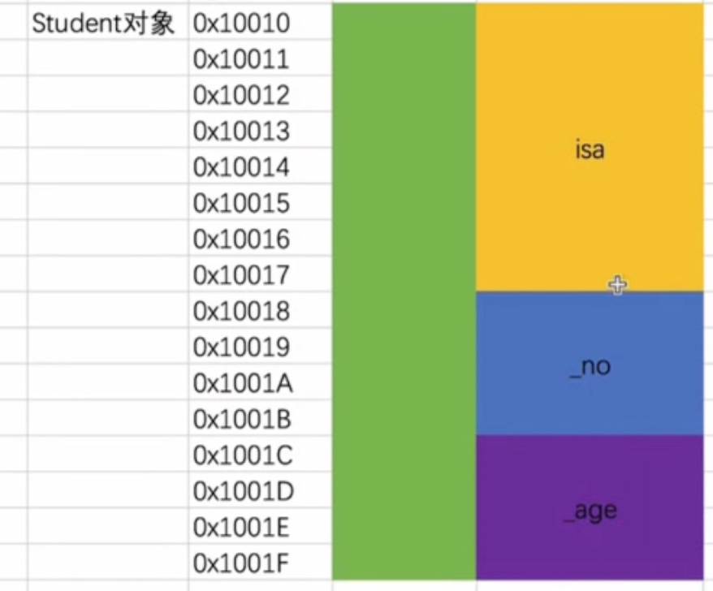
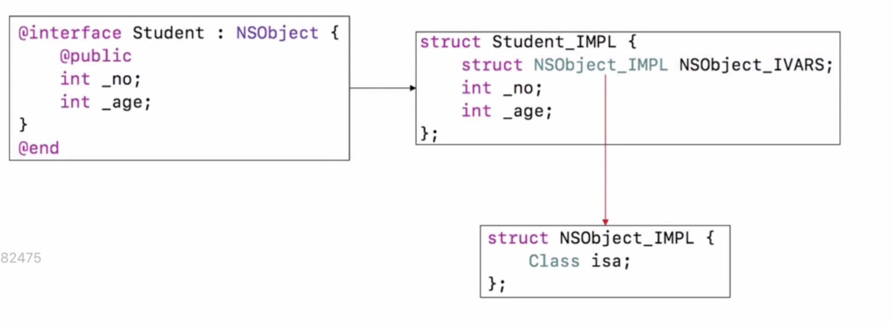

# 内存本质

>面试题：一个NSObject对象占用多少内存？

探寻OC对象的本质，我们平时编写的Objective-C代码，底层实现其实都是C\C++代码。


**OC的对象结构都是通过基础C\C++的结构体实现的**
**我们通过创建OC文件及对象，并将OC文件转化为C++文件来探寻OC对象的本质**

OC如下代码
```
#import <Foundation/Foundation.h>

int main(int argc, const char * argv[]) {
    @autoreleasepool {
        NSObject *objc = [[NSObject alloc] init];
        
        NSLog(@"Hello, World!");
    }
    return 0;
}
```

#### OC文件转化为C++代码

###### clang转化(不区分平台)
我们通过命令行将OC的`mian.m`文件转化为c++文件。
```
clang -rewrite-objc main.m -o main.cpp // 这种方式没有指定架构例如arm64架构 其中cpp代表（c plus plus）
生成 main.cpp
```

###### xcrun转化(区分平台 推荐！！)
我们可以指定架构模式的命令行，使用xcode工具 `xcrun`
```
xcrun -sdk iphoneos clang -arch arm64 -rewrite-objc main.m -o main-arm64.cpp 
生成 main-arm64.cpp 
```

#### 查看C++源码
`main-arm64.cpp` 文件中搜索`NSObjcet`，可以找到`NSObjcet_IMPL`（`IMPL`代表 `implementation` 实现）

我们看一下NSObject_IMPL内部
```
struct NSObject_IMPL {
    Class isa;
};

// 查看Class本质
typedef struct objc_class *Class;
我们发现Class其实就是一个指针，对象底层实现其实就是这个样子。
```

思考： 一个OC对象在内存中是如何布局的。
`NSObjcet`的底层实现，点击`NSObjcet`进入发现`NSObject`的内部实现

```
@interface NSObject <NSObject> {
#pragma clang diagnostic push
#pragma clang diagnostic ignored "-Wobjc-interface-ivars"
    Class isa  OBJC_ISA_AVAILABILITY;
#pragma clang diagnostic pop
}
@end
```

转化为c语言其实就是一个结构体
```
struct NSObject_IMPL {
    Class isa;
};
```

>那么这个结构体占多大的内存空间呢，我们发现这个结构体只有一个成员，isa指针，而指针在64位架构中占8个字节。也就是说一个NSObjec对象所占用的内存是8个字节。到这里我们已经可以基本解答第一个问题。但是我们发现NSObject对象中还有很多方法，那这些方法不占用内存空间吗？其实类的方法等也占用内存空间，但是这些方法所占用的存储空间并不在NSObject对象中。
 
- ` class_getInstanceSize([NSObject class])`返回时对象中元素占据的空间大小对齐后的大小(原则上小于分配的大小 因为有对齐操作的影响和基于分配效率的考量)
- `malloc_size`获取类分配时候真正分配的代销
 
 
为了探寻OC对象在内存中如何体现，我们来看下面一段代码

```
NSObject *objc = [[NSObject alloc] init];
```

上面一段代码在内存中如何体现的呢？上述一段代码中系统为NSObject对象分配8个字节的内存空间，用来存放一个成员isa指针。那么isa指针这个变量的地址就是结构体的地址，也就是NSObjcet对象的地址。
假设isa的地址为`0x100400110`，那么上述代码分配存储空间给NSObject对象，然后将存储空间的地址赋值给objc指针。objc存储的就是isa的地址。objc指向内存中NSObject对象地址，即指向内存中的结构体，也就是isa的位置。

#### 自定义类的内部实现
```
@interface Student : NSObject{
    
    @public
    int _no;
    int _age;
}
@end
@implementation Student

int main(int argc, const char * argv[]) {
    @autoreleasepool {

        Student *stu = [[Student alloc] init];
        stu -> _no = 4;
        stu -> _age = 5;
        
        NSLog(@"%@",stu);
    }
    return 0;
}
@end
```

按照上述步骤同样生成c++文件。并查找`Student`，我们发现`Student_IMPL`
```
struct Student_IMPL {
    struct NSObject_IMPL NSObject_IVARS;
    int _no;
    int _age;
};
```







发现第一个是 `NSObject_IMPL`的实现。而通过上面的实验我们知道`NSObject_IMPL`内部其实就是`Class isa`
那么我们假设 `struct NSObject_IMPL NSObject_IVARS`; 等价于 `Class isa`

可以将上述代码转化为
```
struct Student_IMPL {
    Class *isa;
    int _no;
    int _age;
};
```

因此此结构体占用多少存储空间，对象就占用多少存储空间。因此结构体占用的存储空间为，isa指针8个字节空间+int类型_no4个字节空间+int类型_age4个字节空间共16个字节空间

```
Student *stu = [[Student alloc] init];
stu -> _no = 4;
stu -> _age = 5;
```

那么上述代码实际上在内存中的体现为，创建`Student`对象首先会分配16个字节，存储3个东西，`isa指针8个字节，4个字节的_no ,4个字节的_age`


`sutdent`对象的3个变量分别有自己的地址。而stu指向isa指针的地址。因此stu的地址为0x100400110，stu对象在内存中占用16个字节的空间。并且经过赋值，_no里面存储4 ，_age里面存储5

验证Student在内存中模样
```
struct Student_IMPL {
    Class isa;
    int _no;
    int _age;
};

@interface Student : NSObject
{
    @public
    int _no;
    int _age;
}
@end

@implementation Student

int main(int argc, const char * argv[]) {
    @autoreleasepool {
            // 强制转化
            struct Student_IMPL *stuImpl = (__bridge struct Student_IMPL *)stu;
            NSLog(@"_no = %d, _age = %d", stuImpl->_no, stuImpl->_age); // 打印出 _no = 4, _age = 5
    }
    return 0;
}

```


上述代码将oc对象强转成Student_IMPL的结构体。也就是说把一个指向oc对象的指针，指向这种结构体。由于我们之前猜想，对象在内存中的布局与结构体在内存中的布局相同，那么如果可以转化成功，说明我们的猜想正确。由此说明stu这个对象指向的内存确实是一个结构体。
实际上想要获取对象占用内存的大小，可以通过更便捷的运行时方法来获取。

```
class_getInstanceSize([Student class])
NSLog(@"%zd,%zd", class_getInstanceSize([NSObject class]) ,class_getInstanceSize([Student class]));
// 打印信息 8和16
```


#### 窥探内存结构
实时查看内存数据

**方式一：通过打断点。**
`Debug Workflow -> viewMemory address`中输入stu的地址


从上图中，我们可以发现读取数据从高位数据开始读，查看前16位字节，每四个字节读出的数据为
16进制 `0x0000004(4字节) 0x0000005(4字节)` isa的地址为 `00D1081000001119`(8字节)

**方式二：通过lldb指令xcode自带的调试器**
```
memory read 0x10074c450
// 简写  x 0x10074c450

// 增加读取条件
// memory read/数量格式字节数  内存地址
// 简写 x/数量格式字节数  内存地址
// 格式 x是16进制，f是浮点，d是10进制
// 字节大小   b：byte 1字节，h：half word 2字节，w：word 4字节，g：giant word 8字节

示例：x/4xw    //   /后面表示如何读取数据 w表示4个字节4个字节读取，x表示以16进制的方式读取数据，4则表示读取4次
```

同时也可以通过lldb修改内存中的值
```
memory write 0x100400c68 6
将_no的值改为了6
```


> 那么一个NSObject对象占用多少内存？
NSObjcet实际上是只有一个名为isa的指针的结构体，因此占用一个指针变量所占用的内存空间大小，如果64bit占用8个字节，如果32bit占用4个字节。

#### 更复杂的继承关系
> 面试题：在64bit环境下， 下面代码的输出内容？

```
/* Person */
@interface Person : NSObject
{
    int _age;
}
@end

@implementation Person
@end

/* Student */
@interface Student : Person
{
    int _no;
}
@end

@implementation Student
@end

int main(int argc, const char * argv[]) {
    @autoreleasepool {
        
        NSLog(@"%zd  %zd",
              class_getInstanceSize([Person class]),
              class_getInstanceSize([Student class])
              );
    }
    return 0;
}
```

> 这道面试题的实质是想问一个Person对象，一个Student对象分别占用多少内存空间？

我们依据上面的分析与发现，类对象实质上是以结构体的形式存储在内存中，画出真正的内存图例


我们发现只要是继承自NSObject的对象，那么底层结构体内一定有一个isa指针。
那么他们所占的内存空间是多少呢？单纯的将指针和成员变量所占的内存相加即可吗？上述代码实际打印的内容是16 16，也就是说，person对象和student对象所占用的内存空间都为16个字节。
其实实际上person对象确实只使用了12个字节。但是因为内存对齐的原因。使person对象也占用16个字节。

> 编译器在给结构体开辟空间时，首先找到结构体中最宽的基本数据类型，然后寻找内存地址能是该基本数据类型的整倍的位置，作为结构体的首地址。将这个最宽的基本数据类型的大小作为对齐模数。
为结构体的一个成员开辟空间之前，编译器首先检查预开辟空间的首地址相对于结构体首地址的偏移是否是本成员的整数倍，若是，则存放本成员，反之，则在本成员和上一个成员之间填充一定的字节，以达到整数倍的要求，也就是将预开辟空间的首地址后移几个字节。

> 我们可以总结内存对齐为两个原则：
原则 1. 前面的地址必须是后面的地址正数倍,不是就补齐。
原则 2. 整个Struct的地址必须是最大字节的整数倍。


通过上述内存对齐的原则我们来看，person对象的第一个地址要存放isa指针需要8个字节，第二个地址要存放_age成员变量需要4个字节，根据原则一，8是4的整数倍，符合原则一，不需要补齐。然后检查原则2，目前person对象共占据12个字节的内存，不是最大字节数8个字节的整数倍，所以需要补齐4个字节，因此person对象就占用16个字节空间。
而对于student对象，我们知道sutdent对象中，包含person对象的结构体实现，和一个int类型的_no成员变量，同样isa指针8个字节，_age成员变量4个字节，_no成员变量4个字节，刚好满足原则1和原则2，所以student对象占据的内存空间也是16个字节。


> 查看苹果的源码'https://opensource.apple.com/tarballs/'