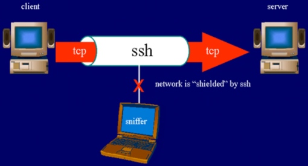
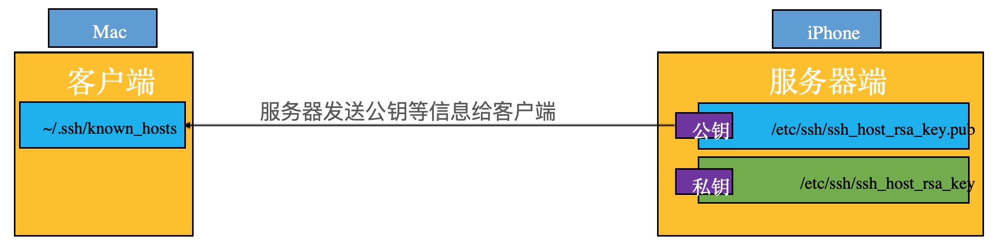
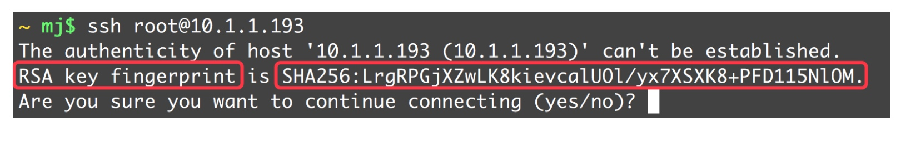
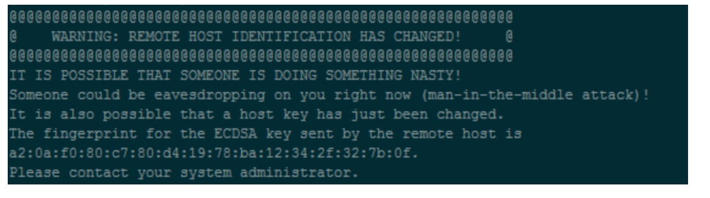
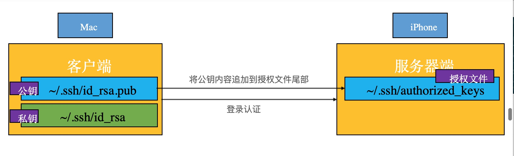
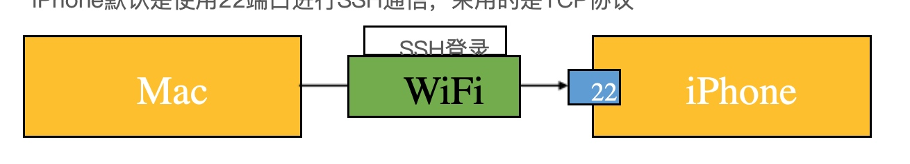
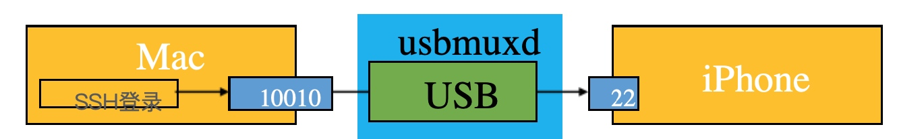

逆向环境的搭建
---

###一：Mac远程登录到iPhone

`iOS`和`Mac OS X`都是基于`Darwin`(苹果的一个基于Unix的开源系统内核)，所以iOS中同样支持终端的命令行操作 在逆向工程中，**我们经常会通过命令行来操纵iPhone**

为了能够让Mac终端中的命令行能作用在`iPhone`上，我们得让`Mac`和`iPhone`建立连接 通过`Mac`远程登录到`iPhone`的方式建立连接


#####1.1.0 SSH、OpenSSH

SSH是`Secure Shell`的缩写，意为“安全外壳协议”，是一种可以为远程登录提供安全保障的协议

**使用SSH，可以把所有传输的数据进行加密，“中间人”攻击方式就不可能实现，能防止DNS欺骗和IP欺骗**



`OpenSSH`是SSH协议的免费开源实现
可以通过`OpenSSH`的方式让`Mac`远程登录到`iPhone`


#####1.1.1 使用OpenSSH远程登录

在iPhone上通过`Cydia`安装`OpenSSH`工具(软件源`http://apt.saurik.com`)

#####1.1.2  使用OpenSSH远程登录 
`SSH`是通过`TCP`协议通信，所以**要确保Mac和iPhone在同一局域网下，比如连接着同一个WiFi**
- 1: 在Mac的终端输入ssh 账户名@服务器主机地址(比如`ssh root@10.1.1.168`（这里的服务器是手机） 初始密码`alpine`)
- 2: 登录成功后就可以使用终端命令行操作iPhone
- 3: 退出登录命令是exit

#####1.1.3 root、mobile

OS下有2个常用账户:`root`、`mobile`
root:最高权限账户，$HOME是`/var/root mobile`:普通权限账户，只能操作一些普通文件，不能操作系统级别的文件，$HOME是`/var/mobile`

登录mobile用户:`root mobile@服务器主机地址` **`root`和`mobile`用户的初始登录密码都是`alpine`**

最好修改一下root和mobile用户的登录密码(登录root账户后，分别通过passwd、passwd mobile完成)

#####1.1.4 SSL、OpenSSL
- SSL是`Secure Sockets Layer`的缩写，是为网络通信提供安全及数据完整性的一种安全协议，在传输层对网络连接进行加密
- `OpenSSL`是SSL的开源实现, 绝大部分HTTPS请求等价于:`HTTP + OpenSSL`
- `OpenSSH`的加密就是通过`OpenSSL`完成的


#####1.1.5 SSH的版本
现在用的比较多的是SSH-2，客户端和服务端版本要保持一致才能通信

查看SSH版本(查看配置文件的Protocol字段)
```
客户端:/etc/ssh/ssh_config
服务端:/etc/ssh/sshd_config
```

#####1.1.6 SSH的通信过程
- 建立安全连接
- 客户端认证
- 数据传输

**建立安全连接**

● 在建立安全连接过程中，服务器会提供自己的身份证明


● 如果客户端并无服务器端的公钥信息，就会询问是否连接此服务器


服务器身份信息变更

在建立安全连接过程中，可能会遇到以下错误信息:提醒服务器的身份信息发生了变更



- 如果确定要连接此服务器，删除掉之前服务器的公钥信息就行
`ssh-keygen -R 服务器IP地址`
- 直接打开`known_hosts`文件删除服务器的公钥信息就行
`vim ~/.ssh/known_hosts`


**SSH的客户端认证方式**

SSH-2提供了2种常用的客户端认证方式
- 基于密码的客户端认证(使用账号和密码即可认证)
- 基于密钥的客户端认证(免密码认证、最安全的一种认证方式)

**SSH-2默认会优先尝试“密钥认证”，如果认证失败，才会尝试“密码认证”**

**SSH - 基于密钥的客户端认证**


**SSH - 基于密钥的客户端认证**

在客户端生成一对相关联的密钥(Key Pair):`一个公钥(Public Key)，一个私钥(Private Key)`

```
ssh-keygen
```
一路敲回⻋键(Enter)即可
OpenSSH默认生成的是RSA密钥，可以通过-t参数指定密钥类型 生成的公钥:`~/.ssh/id_rsa.pub`,生成的私钥:`~/.ssh/id_rsa`.


把客户端的公钥内容追加到服务器的授权文件(`~/.ssh/authorized_keys`)尾部

`ssh-copy-id root@服务器主机地址`

需要输入root用户的登录密码 `ssh-copy-id会将客户端~/.ssh/id_rsa.pub的内容自动追加到服务器的~/.ssh/authorized_keys`尾部

注意:由于是在~文件夹下操作，所以上述操作仅仅是解决了root用户的登录问题(不会影响mobile用户)

**公钥 >> 授权文件**
可以使用`ssh-copy-id`将客户端的公钥内容自动追加到服务器的授权文件尾部，也可以手动操作

 复制客户端的公钥到服务器某路径
 
 ```
 scp ~/.ssh/id_rsa.pub root@服务器主机地址:~
 ```
`scp`是`secure copy`的缩写，是基于`SSH`登录进行安全的远程文件拷⻉命令，把一个文件copy到远程另外一台主机上 上面的命令行将客户端的`~/.ssh/id_rsa.pub`拷⻉到了服务器的~地址


SSH登录服务器
`ssh root@服务器主机地址`
需要输入root用户的登录密码

在服务器创建.ssh文件夹
`mkdir .ssh`

追加公钥内容到授权文件尾部
`cat ~/id_rsa.pub >> ~/.ssh/authorized_keys`

删除公钥
`rm ~/id_rsa.pub`


### 二 22端口

●  端口就是设备对外提供服务的窗口，每个端口都有个端口号(范围是0~65535，共2^16个)
● 有些端口号是保留的，已经规定了用途，比如
● 21端口提供FTP服务
● 80端口提供HTTP服务
● 22端口提供SSH服务(可以查看`/etc/ssh/sshd_config`的Port字段)
● iPhone默认是使用22端口进行SSH通信，采用的是TCP协议




**通过USB进行SSH登录**

默认情况下，由于SSH走的是TCP协议，Mac是通过网络连接的方式SSH登录到iPhone，要求iPhone连接WiFi


为了加快传输速度，也可以通过USB连接的方式进行SSH登录 Mac上有个服务程序`usbmuxd`(它会开机自动启动)，可以将Mac的数据通过USB传输到iPhone
`/System/Library/PrivateFrameworks/MobileDevice.framework/Resources/usbmuxd`




**usbmuxd的使用1**

- 1、下载usbmuxd组件 地址：`https://cgit.sukimashita.com/usbmuxd.git/113`
下载 usbmuxd-1.0.8.tar.gz 这个包。最新的1.1.0的包用法有改变不适用下面方法

- 2、解压我们只需要`python-client`文件夹下`tcprelay.py` 和 `usbmux.py` 文件，你可以单独保存也可以放在目录下，但是无论存在哪里你需要 `cd` 到 `tcprelay.py` 和 `usbmux.py` 文件存放的位置 运行 `chmod +x` `tcprelay.py` 否则运行时将报错：
`-bash: ./tcprelay.py: Permission denied`

- 3、运行 `./tcprelay.py -t 22:1234` 22对应你手机ssh 22端口 后面是映射到你mac的xxxx端口，运行后命令行窗口中显示 `Forwarding local port 1234 to remote port 22` 等待连接

关闭直接control+c 开启后和以前通过WiFi连接不同于root@后面IP地址 WiFi情况下使用手机的IP地址
连接后使用电脑的IP地址

- 4、ssh连接iPhone 另行开一个命令行窗口运行 root@localhost -p 1234 此处root@ 后是你Mac机器的IP地址 也可以直接用localhost代表本机，-p 一定要加 -p后面跟的就是你利用 ./tcprelay.py -t 22:1234 设置的端口

- 5、输入手机上ssh的密码，好了你会发现你已经进入手机 默认alpine 强烈建议修改掉默认密码


**iOS终端的中文乱码问题**

默认情况下，iOS终端不支持中文输入和显示
