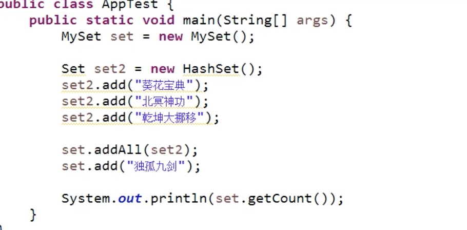
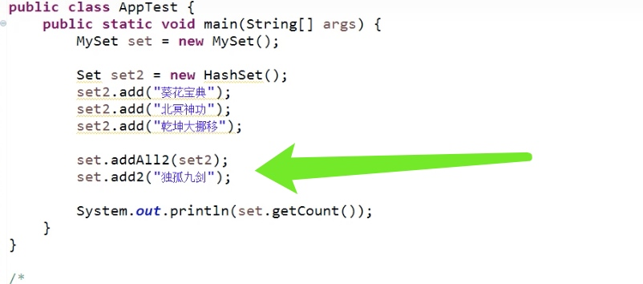
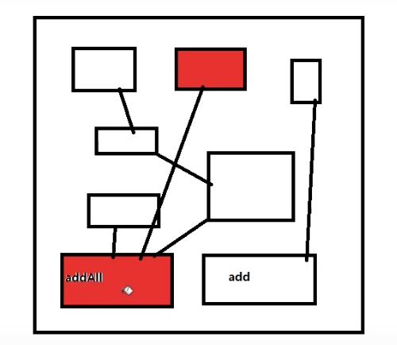

# 组合优于继承

继承就是一个类继承另外一个类

类和类之间存在三种关系
- 继承
- 关联
    - 聚合
    - 组合
- 依赖
- 实现

组合的关系比较强
聚合的关系比较弱

组合优于继承中的组合 其实就是关联关系

**重写功能出现的问题是: **
- 1: 如果在新的JDK中，HashSet突然增加一个元素加入集合的方法 `addSome` 这个`addSome`是我们始料未及的， 我们的MySet根本没有重写新版本出现的`addSome`方法，我们的`MySet`也继承了`addSome`, 当使用`addSome`方法添加元素的时候 根本不回统计元素的数量
- 2: 我们重写了`addAll`的方法，和add方法。 在hashSet里面难免会有其他的方法依赖addAll和all方法。 我们没头没尾的重写了别人的类中的某些方法。 我们就会导致依赖这些方法的方法出现问题

**重写新的方法可能出现的问题是: **
- 1: 目前情况对用户要求有些过分。用户必须看类的Api文档，看完还要怪怪的调用`add2`和`addAll2`不能写错
- 2: 更加致命的问题是，在新版本的JDK中 HashSet恰恰多出了一个api 叫做`add2`和`addAll2`

继承已经尽终了

**解决方案**
- 我们的MySet 不要在继承HashSet了
- 我们让MySet和HashSet发生关联关系

继承的使用原则
- 如果父类作者和子类作者不是一个人 就别继承了
    - 那么父类作者， 不知道未来的子类会重写自己的那个方法
    - 那么子类作者，不知道 未来的父类会增加什么新方法

- 如果父类作者和子类的方法是同一个人，就可以放开手脚去使用继承了
- 自己当然知道，每个方法都是什么作用 作者可以同时控制父类和子类

我们自己写代码 继承和重写随便使用

如果我们仅仅是为了复用代码，而继承别人的类。难免出现沟通上的问题

