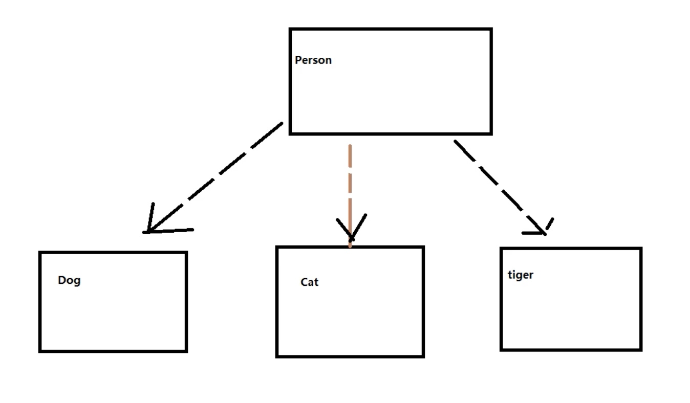
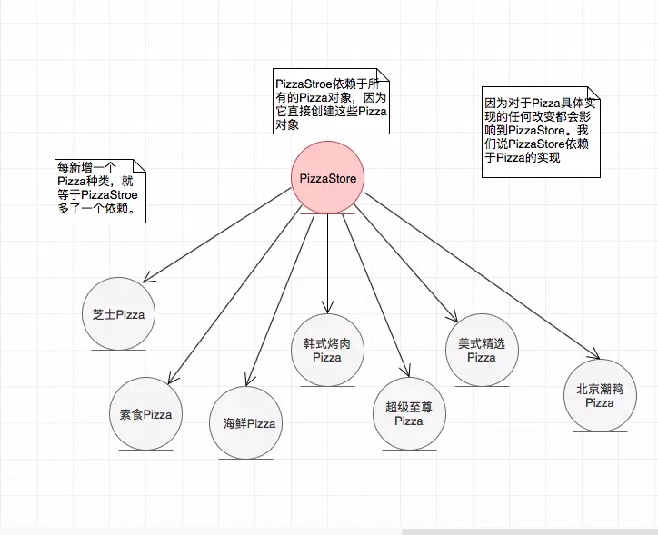
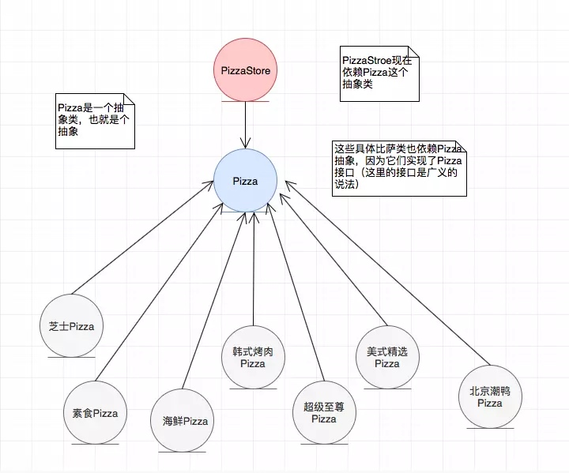

### 依赖倒置


依赖倒置原则（Dependence Inversion Principle）是程序要依赖于抽象接口，不要依赖于具体实现。简单的说就是要求对抽象进行编程，不要对实现进行编程，这样就降低了客户与实现模块间的耦合。

**依赖倒置原则**
- 1) 高层模块不应该依赖低层模块，二者都应该依赖其抽象
- 2) 抽象不应该依赖细节，细节应该依赖抽象
- 3) 依赖倒转(倒置)的中心思想是面向接口编程
- 4) 依赖倒转原则是基于这样的设计理念:相对于细节的多变性，抽象的东西要稳定的 多。以抽象为基础搭建的架构比以细节为基础的架构要稳定的多。在java中，抽象 指的是接口或抽象类，细节就是具体的实现类
- 5) 使用接口或抽象类的目的是制定好规范，而不涉及任何具体的操作，把展现细节的 任务交给他们的实现类去完成


**什么是上层？ 什么是下层**
调用别的方法的是上层
被其他的方法调用的就是下层


面向过程的开发，上层调用下层，上层依赖于下层，当下层剧烈变动时上层也要跟着变动，这就会导致模块的复用性降低而且大大提高了开发的成本。

面向对象的开发很好的解决了这个问题，一般情况下抽象的变化概率很小，让用户程序依赖于抽象，实现的细节也依赖于抽象。即使实现细节不断变动，只要抽象不变，客户程序就不需要变化。这大大降低了客户程序与实现细节的耦合度。



没增加一个种类 person都的依赖一下 倒置开闭和依赖倒置原则被违反


违反依赖倒置，每次下层变动时, 上层都要跟着一起变动

我们希望的是, 每当下层新增一个动物时, 上层应该是“不知道”, 上层代码应该不用改动的


> High level modules should not depend upon low level modules. Both should depend upon abstractions.
Abstractions should not depend upon details. Details should depend upon abstractions.
 
 

**在依赖倒置原则中的倒置指的是和一般OO设计的思考方式完全相反**

举个例子，现在你需要实现一个比萨店，你第一件想到的事情是什么？我想到的是一个比萨店，里面有很多具体的比萨，如：芝士比萨、素食比萨、海鲜比萨……
比萨店是上层模块，比萨是下层模块，如果把比萨店和它依赖的对象画成一张图，看起来是这样：
 
 
  每一个逻辑的实现都是由原子逻辑组成的，不可分割的原子逻辑就是低层模块(一般是接口，抽象类)，原子逻辑的组装就是高层模块。在Java语言中，抽象就是指接口和或抽象类，两者都不能被直接实例化。细节就是实现类，实现接口或继承抽象类而产生的类就是细节，可以被直接实例化。下面是依赖倒置原则在Java语言中的表现：
 
 - 模块间的依赖通过抽象发生，实现类之间不发生直接的依赖关系，其依赖关系是通过接口或抽象类产生的
- 接口或抽象类不依赖于实现类
- 实现类依赖于接口或抽象类

**更为精简的定义：面向接口编程(Object-Oriented Design, OOD)**

**DIP的好处： 采用依赖倒置原则可以减少类间的耦合性，提高系统的稳定性，降低并行开发引起的风险，提高代码的可读性和可维护性**

**DIP的使用**

>从上面的类图中可以看出，司机类和奔驰车类都属于细节，并没有实现或继承抽象，它们是对象级别的耦合。通过类图可以看出司机有一个drive()方法，用来开车，奔驰车有一个run()方法，用来表示车辆运行，并且奔驰车类依赖于司机类，用户模块表示高层模块，负责调用司机类和奔驰车类。

```
public class Driver {
  //司机的主要职责就是驾驶汽车
   public void drive(Benz benz){
      benz.run();
  }
}

public class Benz {
    //汽车肯定会跑
    public void run(){
    System.out.println("奔驰汽车开始运行...");
 }
}

//高层模块
public class Client {
   public static void main(String[] args) {
     Driver xiaoLi = new Driver();
     Benz benz = new Benz();
    //小李开奔驰车
    xiaoLi.drive(benz);
 }
} 
```

 这样的设计乍一看好像也没有问题，**小李只管开着他的奔驰车就好。但是假如有一天他不想开奔驰了，想换一辆宝马车玩玩怎么办呢？我们当然可以新建一个宝马车类，也给它弄一个run()方法，但问题是，这辆车有是有了，但是小李却不能开啊。因为司机类里面并没有宝马车的依赖，所以小李空看着宝马车在那儿躺着，自己却没有钥匙，你说郁不郁闷呢？**

```
public class BMW {
    //宝马车当然也可以开动了
   public void run(){
    System.out.println("宝马汽车开始运行...");
  }
}
```

** 上面的设计没有使用依赖倒置原则，我们已经郁闷的发现，模块与模块之间耦合度太高，生产力太低，只要需求一变就需要大面积重构，说明这样的设计是不合理。现在我们引入依赖倒置原则，重新设计的类图如下：**

```
//将司机模块抽象为一个接口
public interface IDriver {
     //是司机就应该会驾驶汽车
     public void drive(ICar car);
}

public class Driver implements IDriver{
    //司机的主要职责就是驾驶汽车
    public void drive(ICar car){
        car.run();
    }
}

//将汽车模块抽象为一个接口：可以是奔驰汽车，也可以是宝马汽车
public interface ICar {
      //是汽车就应该能跑
      public void run();
}

public class Benz implements ICar{
    //汽车肯定会跑
    public void run(){
        System.out.println("奔驰汽车开始运行...");
  }
}

public class BMW implements ICar{
   //宝马车当然也可以开动了
   public void run(){
      System.out.println("宝马汽车开始运行...");
   }
}

//高层模块
public class Client {
     public static void main(String[] args) {
       IDriver xiaoLi = new Driver();
       ICar benz = new Benz();
      //小李开奔驰车
      xiaoLi.drive(benz);
   }
} 
```
 
 
  在新增低层模块时，只修改了高层模块(业务场景类)，对其他低层模块(Driver类)不需要做任何修改，可以把"变更"的风险降低到最低。在Java中，只要定义变量就必然有类型，并且可以有两种类型：表面类型和实际类型，表面类型是在定义时赋予的类型，实际类型是对象的类型。就如上面的例子中，小李的表面类型是IDriver，实际类型是Driver。

 抽象是对实现的约束，是对依赖者的一种契约，不仅仅约束自己，还同时约束自己与外部的关系，其目的就是保证所有的细节不脱离契约的范畴，确保约束双方按照规定好的契约(抽象)共同发展，只要抽象这条线还在，细节就脱离不了这个圈圈。就好比一场篮球比赛，已经定好了规则，大家如果按照规则来打球，那么会很愉快。但是假如大家脱离了规则，那么也许比赛就无法顺利进行。

**DIP的几种写法**


- **接口声明依赖对象**： 在接口的方法中声明依赖对象，就如上面的例子。

- **构造函数传递依赖对象**： 在类中通过构造函数声明依赖对象(好比Spring中的构造器注入)，采用构造器注入。


```
//将司机模块抽象为一个接口
public interface IDriver {
     public void drive();
}

public class Driver implements IDriver{
    private ICar car;

    //注入
    public void Driver(ICar car){
      this.car = car;
    }

    public void drive(ICar car){
        this.car.run();
    }
}
```

**Setter方法传递依赖对象**： 在抽象中设置Setter方法声明依赖对象(Spring中的方法注入)

```
public interface IDriver{
  //注入依赖
  public void setCar(ICar car);

  public void drive();
}

public class Driver implements IDriver{
  private ICar car;

  public void setCar(ICar car){
    this.car = car;
  }

  public void drive(){
    this.car.run();
  }
}
```

**深入理解**

 依赖倒置原则的本质就是通过抽象(抽象类或接口)使各个类或模块实现彼此独立，不互相影响，实现模块间的松耦合。在项目中使用这个规则需要以下原则;

- 每个类尽量都要有接口或抽象类，或者抽象类和接口都有： 依赖倒置原则的基本要求，有抽象才能依赖倒置
- 变量的表面类型尽量是接口或者抽象类
- 任何类都不应该从具体类派生
- 尽量不要重写基类已经写好的方法(里式替换原则)
- 结合里式替换原则来使用： 结合里式替换原则和依赖倒置原则我们可以得出一个通俗的规则，接口负责定义public属性和方法，并且声明与其他对象的依赖关系，抽象类负责公共构造部分的实现，实现类准确的实现业务逻辑，同时在适当的时候对父类进行细化

**一句话：依赖倒置原则的核心就是面向抽象(抽象类或者接口)编程**
 
 
**UML**
 

没错！先从顶端开始，然后往下到具体类，但是，正如你看到的你不想让比萨店理会这些具体类，要不然比萨店将全都依赖这些具体类。现在“倒置”你的想法……别从上层模块比萨店开始思考，而是从下层模块比萨开始，然后想想看能抽象化些什么。你可能会想到，芝士比萨、素食比萨、海鲜比萨都是比萨，所以它们应该共享一个Pizza接口。对了，你想要抽象化一个Pizza。好，现在回头重新思考如何设计比萨店。



图一的依赖箭头都是从上往下的，图二的箭头出现了从下往上，依赖关系确实“倒置”了

另外，此例子也很好的解释了“上层模块不应该依赖底层模块，它们都应该依赖于抽象。”，在最开始的设计中，高层模块PizzaStroe直接依赖低层模块（各种具体的Pizaa）,调整设计后，高层模块和低层模块都依赖于抽象（Pizza）
