# 设计模式实践之类之间的六种关系


###一、继承（Generalization）

- 继承关系，表示了子类和父类之间的关系
- 箭头：子类指向父类，实线空心三角形箭头
- 代码体现：子类、父类

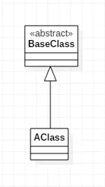

继承表示类与类（或者接口与接口）之间的父子关系。

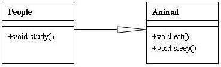

```
class Animal
{
    virtual void Eat();
    virtual void Sleep();
}
class People : public Animal
{
    virtual void Eat();
    virtual void Sleep();
    void Study();
}
```

### 二、实现（Interface Realization）

- 实现关系，表示接口和实现类之间的关系
- 箭头
- 代码体现：接口及实现接口的类

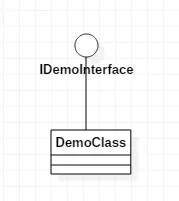

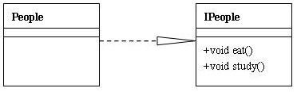


### 三、依赖（Dependency）

- 是一种使用关系
- 箭头 ： 虚线箭头
- 代码体现 ： 局部变量、方法的参数或者对静态方法的调用
- 避免：双向依赖

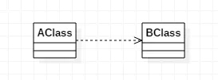

可以简单的理解，就是一个类A使用到了另一个类B，而这种使用关系是具有偶然性的、临时性的、非常弱的，但是B类的变化会影响到A。表现在代码层面，类A当中使用了类B，其中类B是作为类A的方法参数、方法中的局部变量、或者静态方法调用。注意，要避免双向依赖。一般来说，不应该存在双向依赖。

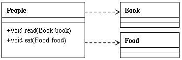

```
//book.h
class Book
{}

//food.h
class Food
{}

//people.h
#include "book.h"
#include "food.h"
class People
{
void read(Book book);
void eat(Food food);
}
```

### 四、关联（Association）

- 是一种拥有的关系,它使一个类知道另一个类的属性和方法
- 箭头
- 代码体现:成员变量
- 注意：单向关联和双向关联

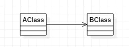

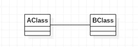

对于两个相对独立的对象，当一个对象的实例与另一个对象的一些特定实例存在固定的对应关系时，这两个对象之间为关联关系。关联关系分为单向关联、双向关联和自身关联。单向关联表现为：类A当中使用了类B，其中类B是作为类A的成员变量。双向关联表现为：类A当中使用了类B作为成员变量；同时类B中也使用了类A作为成员变量。关联关系必须被映射为对象引用或指针。

**双向关联**
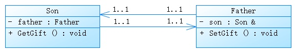

```
class Son
{
public:
   void GetGift()
    {
         cout<<"从"<<father.GetName<<"取得礼物";
    } 

private:
   Father & father; 
}

class Father
{
public:
    void SetGift()
    {
        cout<<"送给"<<son.GetName<<"礼物";
    }

private:
    Son & son;
}
```

### 五、聚合 （Aggregation）

- 整体与部分的关系，部分可以脱离整体存在，聚合关系是关联关系的一种，是强的关联关系；关联和聚合在语法上无法区分，必须考察具体的逻辑关系。
- 箭头
- 代码体现：成员变量


（1）聚合（Aggregation）：C1聚合C2，但是C2可以离开C1而独立存在（独立存在的意思是在某个应用的问题域中这个类的存在有意义。这句话怎么解，请看下面组合里的解释）。

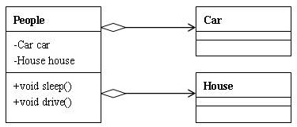

```
class Car{}
class House{}
class People
{
public:
    void Sleep();
    void Drive();
private:
   Car car;
   House house;  
}
```


### 六、组合（Composition）

- 整体与部分的关系，部分不能脱离整体存在
- 箭头
- 代码体现：成员变量

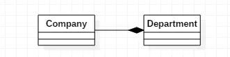

（2）组合（Composition）：C1组合C2，而且C2不能离开C1而独立存在。但这是视问题域而定的，例如在关心汽车的领域里，轮胎是一定要组合在汽车类中的，因为它离开了汽车就没有意义了。但是在卖轮胎的店铺业务里，就算轮胎离开了汽车，它也是有意义的，这就可以用聚合了。在《敏捷开发》中还说到，A组合B，则A需要知道B的生存周期，即可能A负责生成或者释放B，或者A通过某种途径知道B的生成和释放。

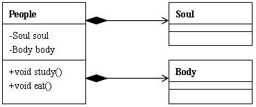
