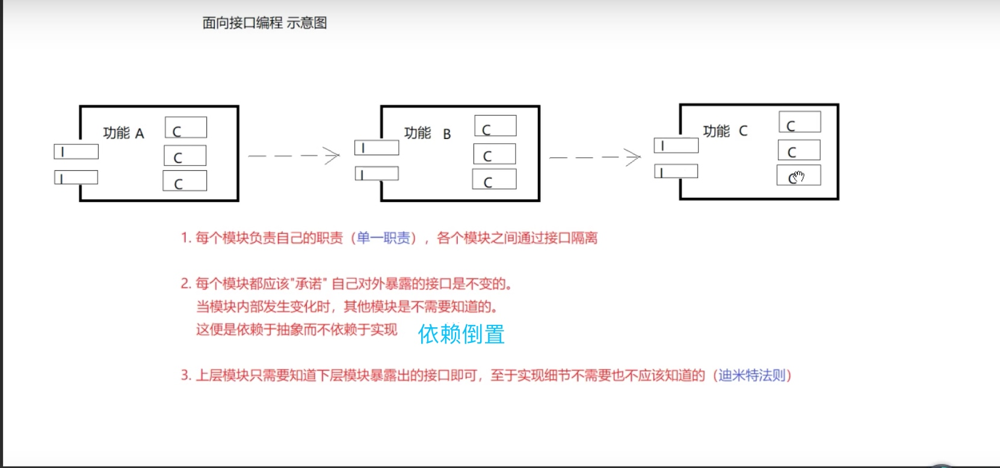
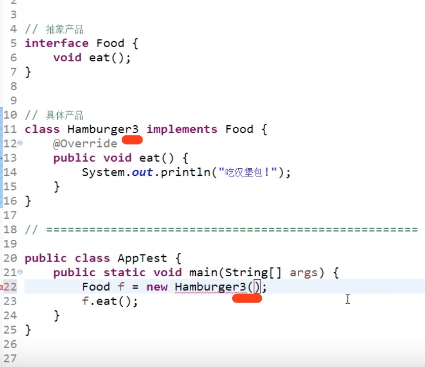
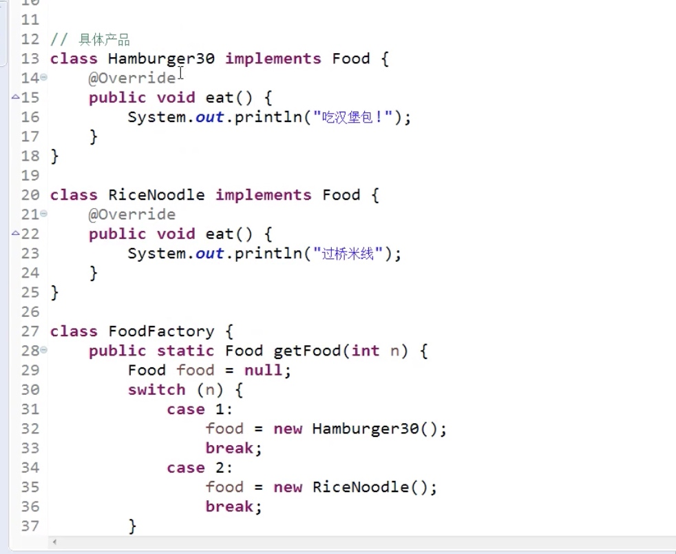
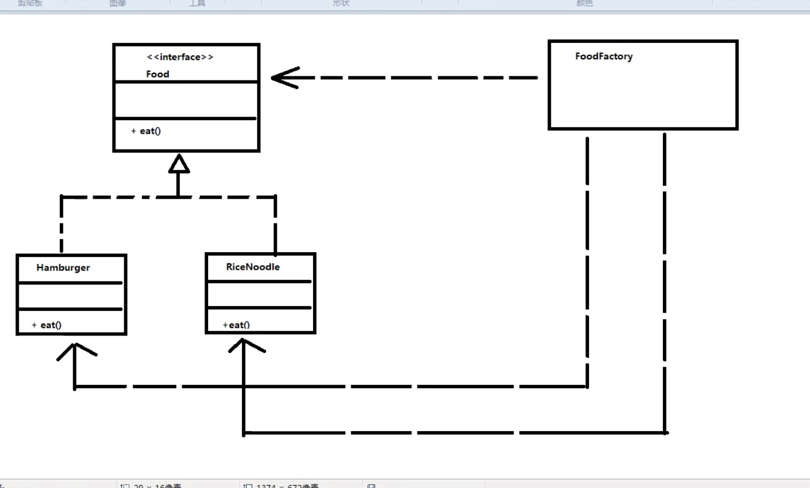

# 简单工厂模式

学习工厂设计模式 必须知道的概念
- 产品
    - 类的实例
- 抽象产品
    - 抽象类、接口
- 产品簇
- 产品等级

学习设计模式 两根弦

- a 开发代码的程序员被划分为两种角色
    - 作者（服务器端程序猿）
    - 用户（客户端程序猿）

    比如我们使用别人封装的功能sdk的功能 我们就是用户，封装sdk的人是服务器程序猿
    

这种设计非常脆弱！ 为什么那？ 因为作者修改了具体产品的类名，那么客户端代码也随之修改

这样服务器的代码和客户端的代码就耦合了

针对a包的问题： 服务器代码一旦修改，服务器的代码也随之修改

修改代码可以使用简单工厂模式实现。

简单工厂的优点-- 符合面向接口编程的思想
- 1: 把具体产品的类型 从客户端代码中解耦出去了
- 2: 服务端如果修改了具体的产品的类名，客户端也不需要知道

简单工厂的缺点
- 1: 客户端不得不死记硬背常量于具体产品的映射关系 比如： 1: 汉堡、2:  米线
- 2: 如果具体产品很多 则简单工厂就会变的比较臃肿。 比如100个具体的产品，则需要在简单工厂中有switch中100个case
- 3: 最重要的是变化来了，客户端需要扩展具体产品的时候。需要修改简单工厂的代码，违反了开闭原则

