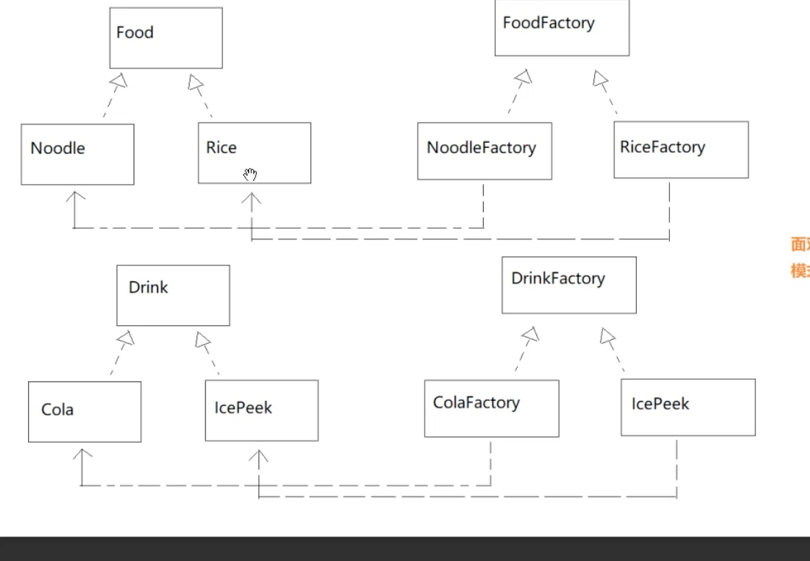

# 工厂方法

**优点**
- 1: 仍然具备简单工厂的优点, 服务器修改了具体产品的类名后，客户端不知道
- 2: 客户端需要扩展一个新的产品， 不需要修改原来的代码。只是扩展一个新的工厂而已

**杠点一**
我们已经知道，简单工厂也好，工厂方法也好都有一个优点。就是服务器的具体产品类名变化以后，客户端不知道！

思考: 但是反观我们的现在代码，客户端仍然依赖于具体的工厂类名呀！ 此时如果服务器端修改具体的工厂类名， 那么客户端也要随之一起修改
    
解释: 工厂的名字是为接口的。 作者有责任、有义务保证工厂的名字是稳定的。也就是说居然客户端依赖于工厂的具体类名。可是在IT业内， 所有工厂的名字是趋于稳定的(并不是100%不会变)。 至少工厂类的名字, 要比具体的产品类的名字更加稳定

**杠点二**

既然产品是我们自己客户端扩展出来的，为什么不直接自己实例化？ 毕竟这个扩展出来的LP这个产品， 我们自己就是作者，我们想怎么改类名。我们自己都能把控，为什么还要为自己制作的产品做工厂那

解释：作者在开发功能时。不仅仅只会开发一些抽象产品、具体产品、对应工厂。 还会配套搭配一些提前做好的框架

**杠点三**

现在制作的`LPFactory` 是为了`LPFactory`传入给`bussiness.taste`方法。 必须定义这个`LPFactory`，那为什么不一开始就让`bussiness.taste`依赖Food参数那。 而不是现在的`FoodFactory`作为参数

工厂比产品更加稳定

缺点： 
如果产品等级很多, 工厂类就会爆炸增长

