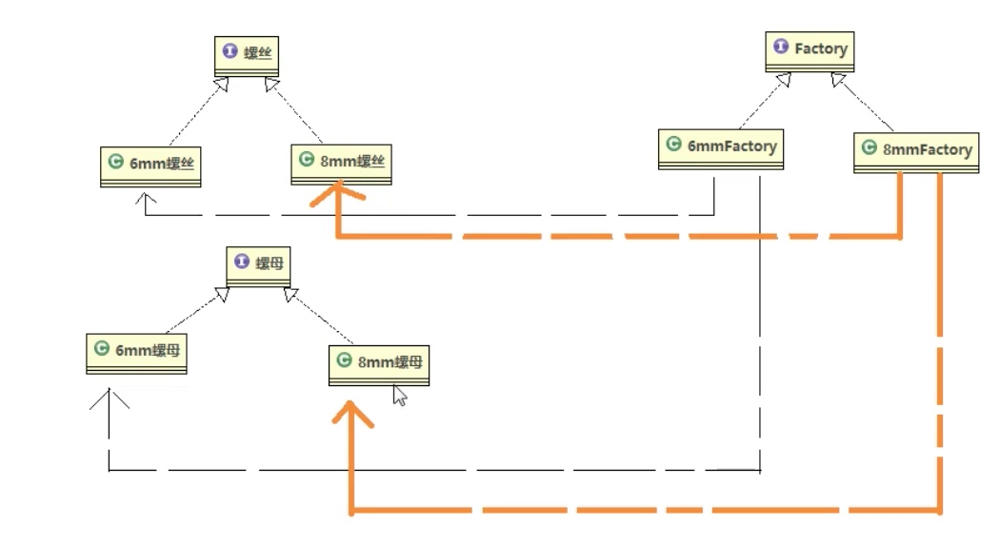
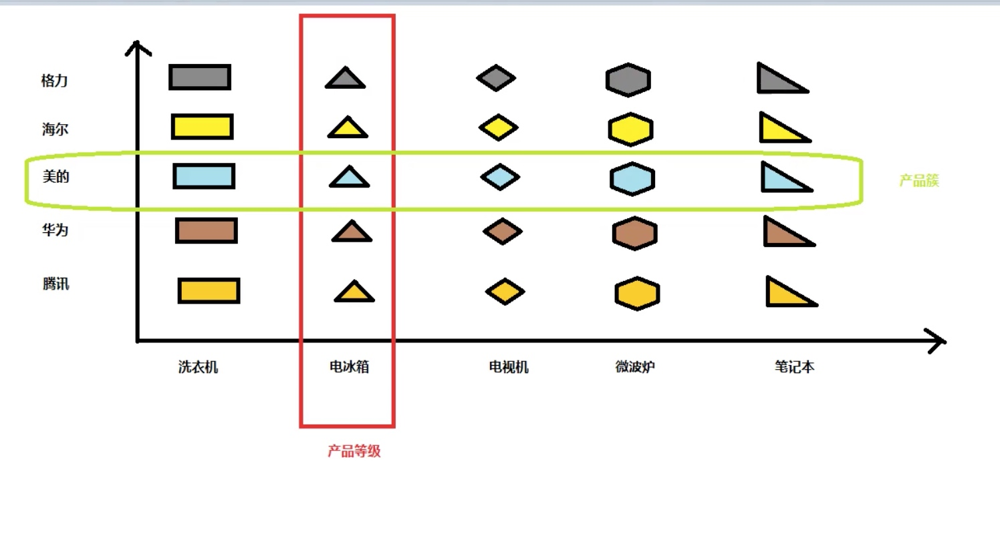

# 抽象工厂

抽象工厂的优点
- 仍然有简单工厂和工厂方法的优点
- 抽象工厂把工厂类的数据减少了！ 如果有多少产品等级 工厂就一套

杠点
为神马三秦工厂中， 必须是米线搭配冰峰， 为什不是米线搭配可乐

解释
抽象工厂可以胜场多个产品, 这多个产品之间必须有内在联系
同一个工厂的产品属于同一个产品簇， 不能吧不同产品簇中的产品混合到一个抽象工厂的实现类中

缺点: 
当产品等级发生变化时(增加产品等价、删除产品等价) 都要引起所有以前工厂代码的修改
违反了开闭原则

