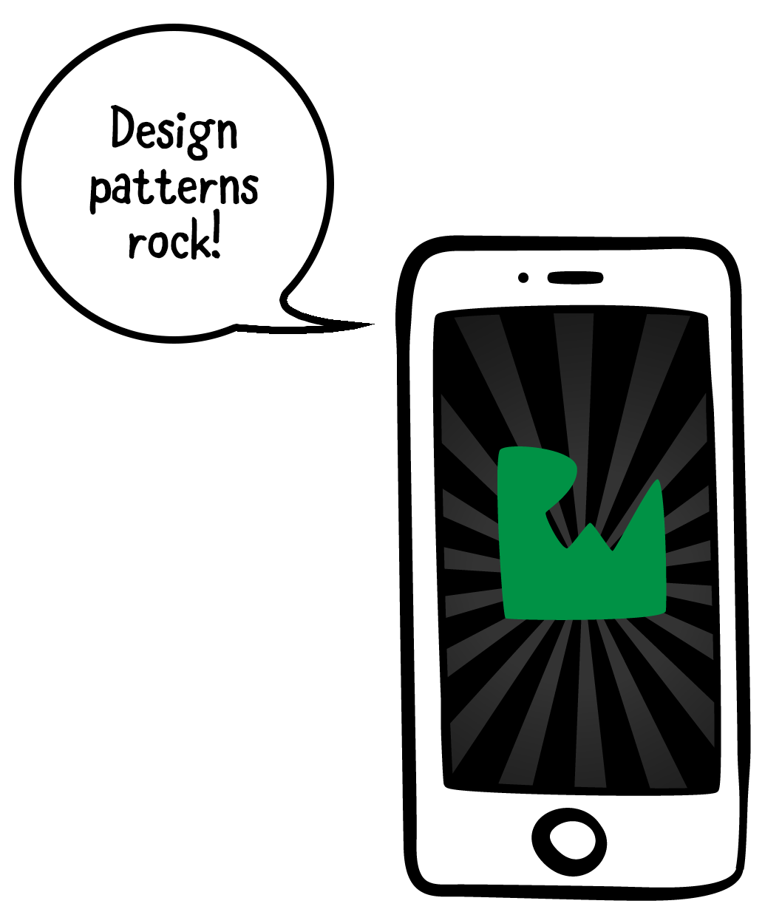

# Chapter One你好设计模式

本文将全面高水准的介绍什么是设计模式、它们为什么那么重要以及它们如何帮助您

在本节中，您还将学习如何阅读和使用类图。这将使您更容易学习设计模式，因此，重要的掌握这一点才能充分利用这本书。

> 什么是设计模式
> 认识UML类图

### 章节一: 什么是设计模式

新手害怕。架构师喜爱。阅读本书中讲到设计模式故事。收获可能会让你感到惊喜！

你知道设计模式可以让你成为一个更好的开发人员吗？“当然，”你说-你毕竟在读这本书！

“你知道设计模式可以帮你赚更多的钱吗？那是当然。通过正确使用设计模式，您可以节省时间，减少工作，并最终创建更多伟大的东西。

   你知道设计模式可以帮助你拥抱变化吗？好吧，也许不是-设计模式毕竟不是银弹。
   
  然而，设计模式是非常有用的，不管你为什么语言或平台开发，每个开发人员都应该绝对了解它们。他们还应该知道如何以及何时应用它们。这就是你在这本书里要学的！”

######1.1 实例

介绍中告诉您设计模式是可重用的，是针对常见开发问题的模板解决方案。设计模式不是具体的实现，而是作为编写代码的起点。它们描述了有经验的开发人员以前多次遇到的问题的通用解决方案。

这到底是什么意思?考虑一下这个非开发的真实场景:

“你自豪地拥有一家园艺公司，你的生意真的，呃，蒸蒸日上。到目前为止，你只做了几个小项目——这里种一棵树，那里种一些花。然而，你刚刚得到一个大客户，他想在他们的土地上种植几十棵树和花。
你的标准程序是让你的员工把每棵花或树苗单独搬到合适的地方。一旦每一个被暂时放置，你的客户检查和批准安排之前，你种植在地面上的一切。

你担心要花很长时间才能把花和树运到这个大项目的地方。你甚至需要一些人来搬一些更大的树。虽然你可以雇佣很多临时工，但你不会从工作中获利。一定有更好的办法!

你决定问问别的园丁他们是干什么的，你会发现他们使用手推车和手推车。真是个好主意!你告诉你的员工用手推车同时运送多朵花，用手推车运送沉重的树木。与此同时，你可以使用休息室……”

###### 解释一下例子

  这里的“设计模式”是使用独轮车和手推车。这些都是园艺中常见的最佳实践工具。类似地，软件设计模式形成了开发中的一组最佳实践。您本可以选择不使用手推车和手推车，但是类似于避免软件设计模式，您通过使项目更加耗时和劳动密集来承担更多的风险。
    
  回到“问其他园丁他们是干什么的”这个问题上。“大多数设计模式已经存在很长一段时间了——从20世纪70年代和80年代就开始了——它们至今仍然工作良好。
    
  这种长寿的部分原因是几十年来它们的使用在许多项目中得到了验证，但也因为它们不是具体的解决方案。
    
  在园艺场景中，您决定用手推车来移动鲜花，用手推车来移动树木。这些是实现细节:您可以使用手推车来移动花和树，只使用手推车，或者其他使工作更容易的组合。

  设计模式是解决常见问题(如使用手推车和手推车)的通用解决方案。它们是具体实现的起点，比如……”

###### 设计模式的类型
设计模式主要有三种类型:
- 结构型模式: 
    描述如何组合和组合对象以形成更大的结构。结构设计模式的示例包括模型-视图-控制器（MVC）、模型-视图-视图-模型（MVVM）和外观
- 行为型模式
    描述对象之间的通信方式。行为设计模式的例子有委托、策略和观察者。
- 创建型模式
    描述如何创建或实例化对象。创造模式的例子有Builder、Singleton和Prototype

    你可能想知道知道设计模式的类型是否真的很重要。嗯,是的…也没有。
    按类型记忆所有的模式是没有用的。大多数开发人员不这样做。但是，如果您不确定某个特定模式是否有效，有时考虑相同类型的其他模式是有用的。你可能会找到一个更好的方法来解决你的问题。

> 注意:关于一些模式，包括MVVM和MVC，是否实际上是架构模式，有一个持续的争论，这些模式跨越了整个应用程序或子系统架构。因此，它们的范围比设计模式更广，设计模式只跨应用程序的组件或部分。架构模式甚至可以使用或包含多个设计模式。
对于本书而言，对架构模式的全面讨论超出了范围。我们选择将MVVM和MVC标记为结构设计模式，因为它们可以与其他设计模式一起以组件的方式使用。它们在iOS项目中也很常用，我们希望确保我们能够覆盖它们。
如果有人说这些实际上是架构模式，我们不一定不同意，因为它们也可以这样使用。
如果你想了解更多关于iOS架构模式的信息，请查看高级iOS应用程序架构(http://bit.ly/ios-app-arch)。

###### 对设计模式的批评

正如前面所指出的，**在软件开发中没有什么灵丹妙药**，设计模式也不例外。这意味着仅仅了解和使用设计模式并不能保证您将创建一个架构良好的软件。有几十种设计模式，所以知道何时以及如何使用每种模式是很重要的。

对设计模式的一些常见批评是什么?”

**如果过度使用设计模式，项目可能会变得过于复杂。**
您需要小心过度使用任何工具，包括设计模式。在向项目中添加设计模式之前，您可以通过清楚、正确地定义要解决的问题来最小化此问题。”

**现代编程语言使许多设计模式变得多余。**
确实，像Swift这样的现代编程语言使得一些设计模式变得无关紧要，或者说实现起来很琐碎。然而，仅仅因为一些模式是通过编程语言提供的，并不意味着所有的模式都是。

**设计模式是学习面向对象原则的懒惰替代品。**
为什么不两者都学呢?对面向对象原则的深刻理解肯定会对您的开发有所帮助。
但是，如果您已经知道一个设计模式可以很好地解决特定的问题，那么为什么还要重新设计解决方案呢?

**但是,但是……看看Twitter上的这个帖子，它明确地表明设计模式是毫无价值的!**
    不管这些批评，设计模式已经存在很长时间了，并且已经在许多应用程序中使用。所以在某个时刻，你会遇到它们。
    我们认为最好是在遇到它们之前就了解它们是什么，而不是试图即兴发挥，在我们的经验中，这通常是在周日晚上的晚些时候，在发布截止日期的前一天，在发现一个关键的bug之后。

###### 设计模式的优点
我们已经提到了设计模式的许多好处，但我们还想指出一些：

**设计模式创造了一种共同的语言**
您可以简单地陈述您认为最适合的设计模式，而不是详细地描述某个特定的解决方案。这简化了开发人员之间的通信

**设计模式快速跟踪开发人员**

与完全自定义逻辑的项目相比，在使用设计模式的项目中使用新开发人员要容易得多

**设计模式让你成为一个更好的人。**
好吧，这个问题可能还有待讨论。但是一定程度的自我提高是绝对不会被浪费的!然而，这有一点是真实的，因为下一个维护您的项目的开发人员肯定会认为您是一个更好的人，因为您给他们留下了一个很好的、充满设计模式的项目，而不是一堆乱七八糟的代码!

**了解设计模式可以让您发现代码之间的相似性**

一旦您了解并理解了不同的设计模式，您就会开始注意到它们在代码中的使用。这将为您提供帮助，因为您至少有一点熟悉如何使用这些代码。例如，iOS和Mac编程大量使用了委托模式。如果你曾经迁移到另一个平台，你会很容易发现这种模式。

###### 核心点
在本章中，您了解了什么是设计模式，以及为什么应该关注它们。以下是需要记住的关键点:
- 设计模式不是具体的实现，而是编写代码的起点。
- 设计模式共同形成了一组最佳实践，以帮助您编写更易于理解和维护的代码。
- 设计模式主要有三种类型:结构化、行为性和创造性。
- 设计模式既有缺点，也有优点。最后，它们在软件开发中很常见，您可能会遇到它们。因此，掌握好它们是很重要的。