# Chapter One 认识UML类图

现在您知道什么是设计模式了!在本章中，您将学习一个帮助您理解设计模式的基本概念:类图。

类图就像工程蓝图;它们通过图片、符号和注释等媒介提供关于一个系统的信息。

您可能听说过统一建模语言(Unified Modeling Language, UML)，这是一种用于创建类图、架构图和其他系统图的标准语言。关于UML的完整讨论超出了本书的范围，但是您不需要在日常的iOS开发中了解很多UML。相反，您将在本章中学习UML的一个子集，它对于创建类图和描述设计模式非常有用。

### 一: 什么是类图
类图包括**类、协议、属性、方法和关系**。

######1.1 继承关系
框表示一个类。下面是一个非常简单的Dog类类图:

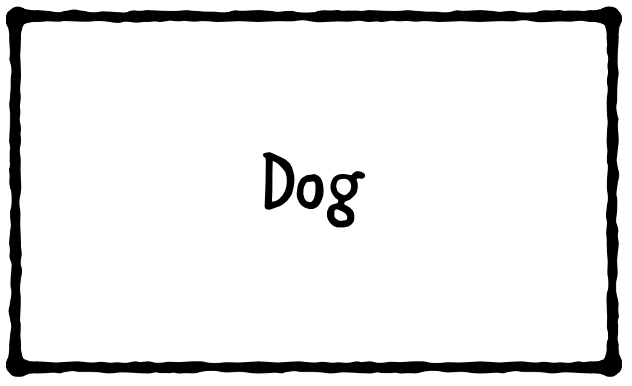

**为了表示一个类继承了另一个类，使用一个打开的箭头:**

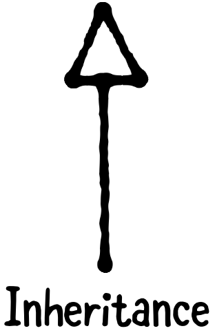

但不要把这个读成“继承而来”，而是读成“是a”。举个例子，为了说明牧羊犬是从狗那里继承来的，你可以画如下图:

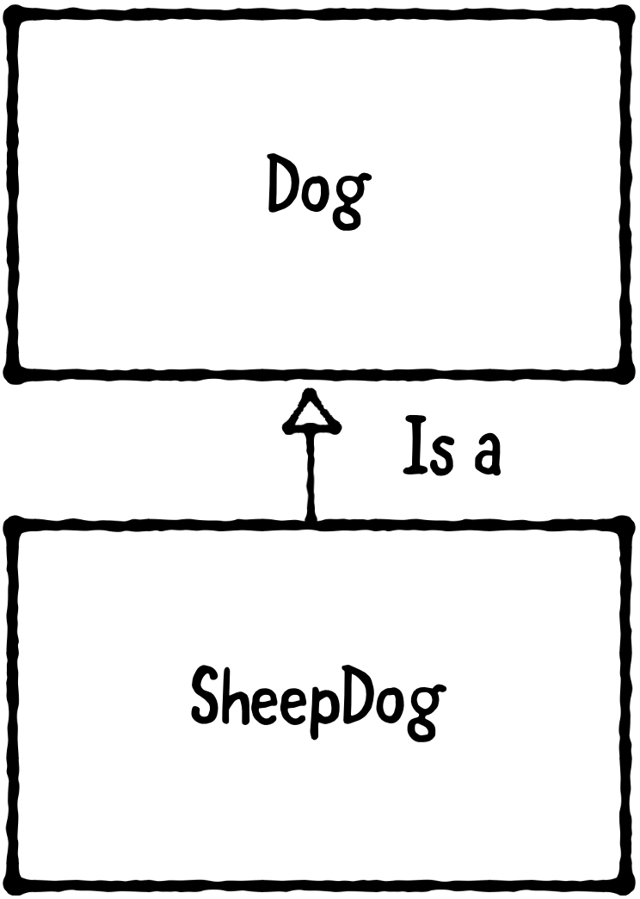

你会把这句话从头到尾读一遍，“牧羊犬就是狗”

###### 1.2 关联

**使用一个简单的箭头来表示一个属性，在UML术语中称为“关联**

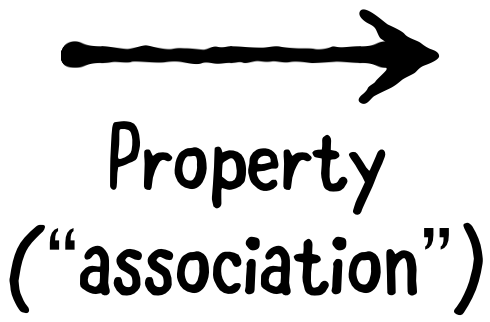

类图可以从下到上，从左到右，或者以您喜欢的任何其他方向来编写。无论方向如何，箭头的方向都定义了含义:**继承箭头总是指向超类，而属性箭头总是指向属性类**

您可以通过在箭头旁边指定一个范围来指示一对多关系。例如，你可以这样表示一个农民有一条或多条狗:
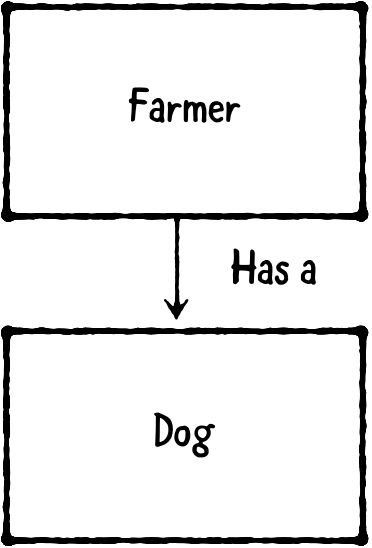

您可以通过在箭头旁边指定一个范围来指示一对多关系。例如，你可以这样表示一个农民有一条或多条狗:
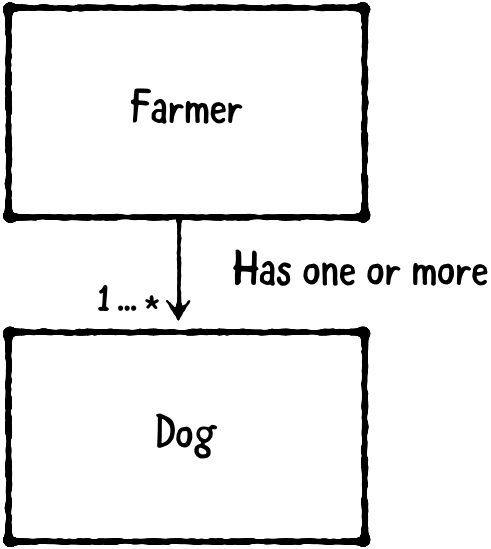

你应该总是在类图中使用类名的单数形式，即使你是在传递一对多的关系。在这种情况下，你应该写Dog，而不是Dogs。

您可以在一个类图中使用任意多的箭头和方框。例如，你可以这样表示一个农民有一只牧羊犬，那就是一只狗:

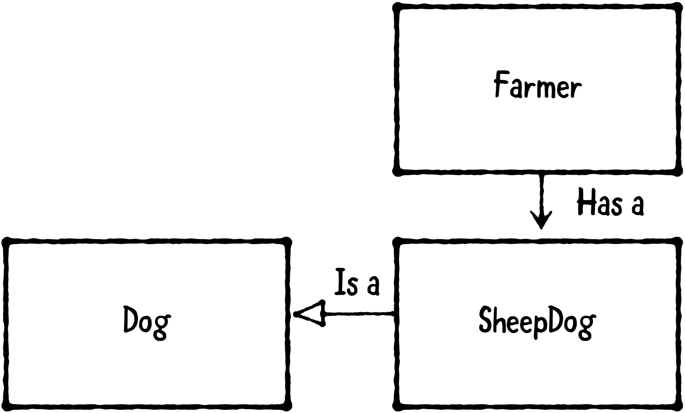

######1.3: 协议
您还可以使用一个方框来表示协议。但是，为了将其与类区分开来，您需要在其名称之前编写<<protocol>>。

下面是一个叫做PetOwning的协议：
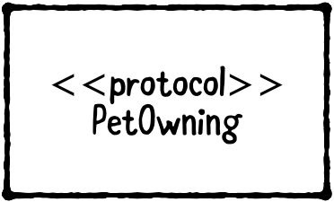

**使用带虚线的开放箭头表示类实现协议：**

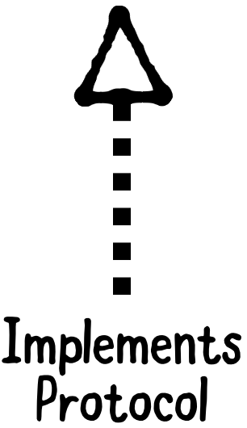

你可以把它读作“实现”或“遵循、遵从、符合”。例如，你可以这样指出农夫符合养宠物的条款
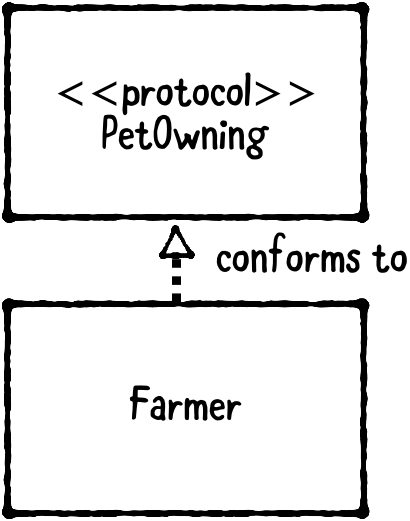

###### 1.4 依赖

**使用带虚线的纯箭头表示“使用”，在UML术语中称为“依赖项”**
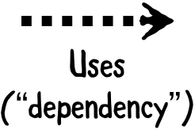

UML故意对什么是“依赖关系”含糊其辞。因此，无论何时使用依赖项箭头，通常都应该注释其用途。例如，可以使用依赖项箭头指示以下内容：
- `weak`的属性或委托。
- 作为参数传递到方法中，但不作为属性保存的对象。
- 松散耦合或回调，如从视图到控制器的`IBAction`

下面是如何指示狗代理到养宠物对象的：
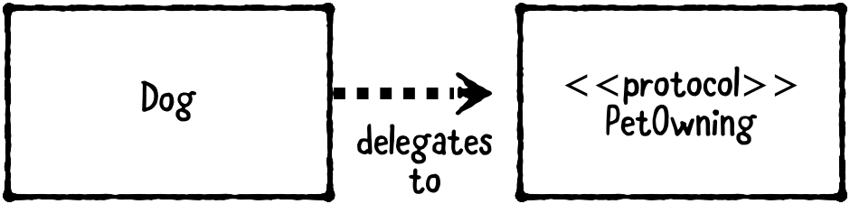

“您还可以在类图中表示属性和方法。例如，您会指出`PetOwning`有一个name属性和一个类似于下面的`petNeedsFood`方法：“

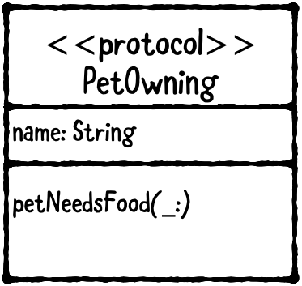

如果箭头的意思很明显，你可以省略任何解释性的文字。通常可以省略对继承、属性和实现箭头的解释。但是，通常应该为“uses”箭头保留文本，因为它们的含义并不总是显而易见的。
这是一个拥有牧羊犬的农夫的完整类图，牧羊犬是一只委托给养宠物对象的狗：
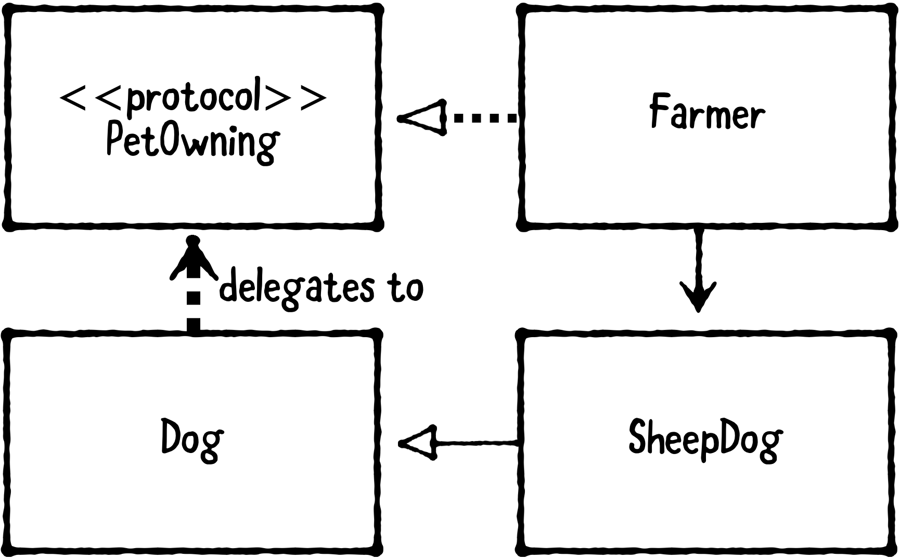

###二： 挑战

既然你已经掌握了基本知识，现在是检验你知识的时候了！

在一张纸上，画出下列每一个挑战的类图。准备好后，检查下一页的答案：

- 狗和猫是从动物身上遗传下来的，这就定义了一种`eat`方法。
- 车辆协议有一个电机和一个或多个车轮对象。
- 教授是教师，遵守个人礼节。

每一项挑战都有许多正确的解决办法。例如，您不必从上到下绘制图表。相反，可以从左到右或其他方向绘制。只要你的类图清楚地表达了你想要表达的意思，它就是正确的！

*Solutions on the next page.*

**解决方案1**。你需要三个箱子：一个给猫，狗和动物。你需要一个开放的箭头从猫到动物和另一个开放的箭头从狗到动物。你还应该在动物身上注明`eat()`

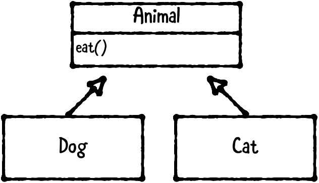

**解决方案2**。
您应该有三个盒子：一个用于车辆、电机和车轮。你应该有一个普通箭头从车辆到汽车和另一个普通箭头从车辆到车轮。你也应该有`一个...*`在指向方向盘的箭头旁边。“

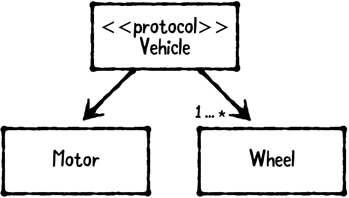

**解决方案3**
这个问题的措词故意含糊不清。我们本来可以说，要么老师符合人，要么教授符合人。在这两种情况下，教授都会直接或通过教师间接地与人相处。”

如果老师符合人，教授继承老师，则类图如下：
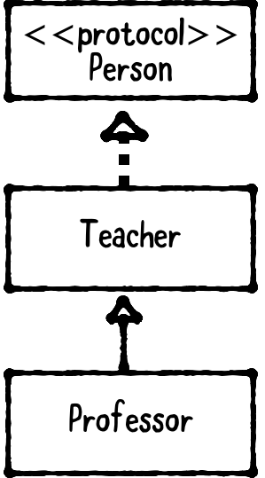

如果教授符合人，而老师不符合，则类图如下：

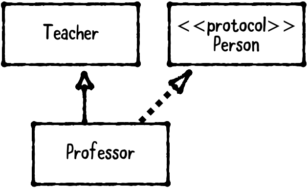

三: 要点

在本章中，您学习了类图的基础知识。这是你需要了解的所有图表在这本书的其余部分。如果你需要的话，你可以随时查阅本章！
以下是您学到的要点：
- 类图给出了类和协议类型的可视化表示，显示了它们的属性和方法。
- 类图还显示了对象类型之间的关系。
- 类图可以在任何其他方向绘制；箭头的方向定义了含义。
- 框表示类，行表示关系：“implements”、“has a”、“uses”和“compliance to”是最常见的关系。
- 方框也可以表示协议，协议名称前用<<protocol>>表示。