# Chapter Three “Model-View-Controller Pattern”

>
“本节介绍基本的iOS设计模式。这些模式在整个iOS开发过程中经常使用，每个iOS开发人员都应该很好地理解这些模式。
这些模式在组合中工作得很好，因此本节中的所有章节都将指导您从头开始构建单个教程项目。”

模型-视图-控制器（MVC）模式将对象分为三种不同的类型。是的，你猜对了：这三种类型是模型、视图和控制器！

以下是这些类型之间的关系：
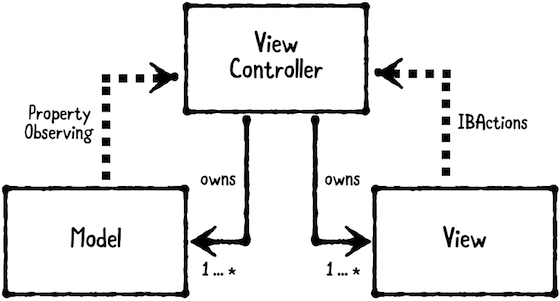

- **模型保存应用程序数据**。它们通常是结构或简单类。
- **视图在屏幕上显示视觉元素和控件**。它们通常是UIView的子类。
- **控制器在模型和视图之间协调**。它们通常是UIViewController的子类。

MVC在iOS编程中非常常见，因为它是苹果在UIKit中选择采用的设计模式。
**允许控制器的模型和视图具有强属性，以便可以直接访问它们。控制器也可以有多个模型或者视图。
相反，模型和视图不应强烈引用其所属控制器。这将导致一个保留周期。**
取而代之的是，模型通过属性观察与控制器通信，您将在后面的章节中深入了解这一点，视图通过`IBActions`与控制器通信。
这允许您在多个控制器之间重用模型和视图.

>注意：视图可能通过委托`weak`其所属的控制器（请参阅第4章“委托模式”）。例如，UITableView可以为`delegate`和`dataSource`引用保留对其所属视图控制器的弱引用。然而，表视图并不知道这些设置为其所属的控制器 

控制器很难重用，因为它们的逻辑通常非常特定于它们正在执行的任何任务。因此，MVC不会尝试重用它们。

### 一：什么时候用MVC

使用此模式作为创建iOS应用程序的起点。
在几乎所有的应用程序中，除了MVC之外，您可能还需要其他模式，但可以根据应用程序的需要引入更多的设计模式。

**Playground example**

打开`Starter`目录中的`FundamentalDesignPatterns.xcworkspace`。这是一个`playground`页面的集合，每个页面对应您将学习的基本设计模式。在本节结束时，您将有一个很好的设计模式参考！

从文件层次结构中打开`Overview`页。

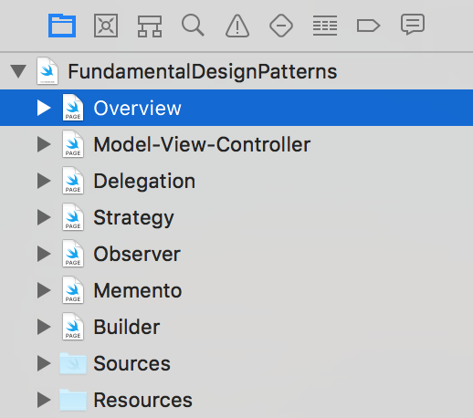

**本页列出了三种设计模式:**

- 结构模式描述了如何组合对象以形成更大的子系统。
- 行为模式描述了对象之间的通信方式。
- 创建模式为您实例化或“创建”对象


MVC是一种结构模式，因为它是以模型、视图或控制器的形式组合对象的。
接下来，从文件层次结构中打开`“Model-View-Controller page`页。对于代码示例，您将使用MVC创建一个`Address`，您能猜出地址屏幕的三个部分是什么吗？一个模型，视图和控制器，当然！在代码示例后添加此代码以创建模型：
```
import UIKit

// MARK: - Address
public struct Address {
  public var street: String
  public var city: String
  public var state: String
  public var zipCode: String
}
```

这将创建一个表示地址的简单结构。

需要导入`UIKit`才能将`AddressView`创建为`UIView next`的子类。添加以下代码:

```
// MARK: - AddressView
public final class AddressView: UIView {
  @IBOutlet public var streetTextField: UITextField!
  @IBOutlet public var cityTextField: UITextField!
  @IBOutlet public var stateTextField: UITextField!
  @IBOutlet public var zipCodeTextField: UITextField!
}
```

在实际的iOS应用程序（而不是`playground`）中，您还可以为此视图创建`xib`或`StoryBoard`，并将`IBOutlet`属性连接到其子视图。稍后，您将在本章的教程项目中练习此操作。
最后，需要创建`AddressViewController`。下一步添加此代码

```
// MARK: - AddressViewController
public final class AddressViewController: UIViewController {

  // MARK: - Properties
  public var address: Address?
  public var addressView: AddressView! {
    guard isViewLoaded else { return nil }
    return (view as! AddressView)
  }
}
```

这里有一个控制器，它对它所拥有的视图和模型有很强的引用。

`addressView`是一个计算属性，因为它只有一个`getter`。它首先检查`isViewLoaded`以防止在视图控制器出现在屏幕上之前创建视图。如果`isViewLoaded`为`true`，则将视图强制转换为`AddressView`。若要不产生⚠️，请用括号将此强制转换括起来。

在实际的iOS应用程序中，您还需要在StoryBoard或xib上指定视图的类，以确保应用程序正确创建AddressView而不是默认的UIView。

回想一下，在模型和视图之间进行协调是控制器的责任。在这种情况下，控制器应该使用来自地址的值更新其`addressView`。
一个好的地方是调用`viewDidLoad`。在`AddressViewController`类的末尾添加以下内容：

```
// MARK: - View Lifecycle
public override func viewDidLoad() {
  super.viewDidLoad()
  updateViewFromAddress()
}

private func updateViewFromAddress() {
  guard let addressView = addressView,
    let address = address else { return }
  addressView.streetTextField.text = address.street
  addressView.cityTextField.text = address.city
  addressView.stateTextField.text = address.state
  addressView.zipCodeTextField.text = address.zipCode
}
```

如果在调用`viewDidLoad`之后设置了地址，那么控制器也应该更新`addressView`。
将address属性替换为以下内容:
```
public var address: Address? {
  didSet {
    updateViewFromAddress()
  }
}
```

这是一个示例，说明模型如何告诉控制器某些内容已更改，视图需要更新。
如果还希望允许用户从视图中更新地址，该怎么办？没错-你应该在控制器上创建一个`IBAction`。
在`updateViewFromAddress()`之后添加此项：

```
// MARK: - Actions
@IBAction public func updateAddressFromView(
  _ sender: AnyObject) {
  
  guard let street = addressView.streetTextField.text, 
    street.count > 0,
    let city = addressView.cityTextField.text, 
    city.count > 0,
    let state = addressView.stateTextField.text, 
    state.count > 0,
    let zipCode = addressView.zipCodeTextField.text, 
    zipCode.count > 0 else {
      // TO-DO: show an error message, handle the error, etc
      return
  }
  address = Address(street: street, city: city,
                    state: state, zipCode: zipCode)
}
```

最后，这是一个示例，说明视图如何告诉控制器某些内容已更改，并且模型需要更新。在实际的iOS应用程序中，您还需要从`AddressView`的子视图连接此`IBAction`，例如`UITextField`上的`valueChanged`事件或`UIButton`上的`touchinde`事件。
总之，这为您提供了一个关于MVC模式如何工作的简单示例。您已经看到了控制器是如何拥有模型和视图的，以及它们如何相互作用，但总是通过控制器。

### 二：MVC使用注意点

“MVC是一个很好的起点，但它有局限性。并不是每个对象都能整齐地归入模型、视图或控制器的类别。因此，只使用MVC的应用程序在控制器中往往有很多逻辑。
这会导致视图控制器变得非常大！当这种情况发生时，有一个相当奇怪的术语，叫做`Massive View Controller`

要解决这个问题，您应该根据应用程序的需要引入其他设计模式。

### 三： 教程工程

在本节中，您将创建一个名为`Rabble Wabble`的教程应用程序。
这是一个语言学习应用程序，类似于`Duolingo`（`http://bit.ly/ios Duolingo`）、`WaniKani`（`http://bit.ly/WaniKani`）和`Anki`（`http://bit.ly/ios Anki`）。
您将从头开始创建项目，因此打开`Xcode`并选择`File▸New▸project`。然后选择`iOS▸单视图应用程序`，然后按下一步。
为产品名称输入`RabbleWabble`；如果没有设置，则选择您的团队或保留为`None`（如果仅使用模拟器，则不需要设置）；将您的组织名称和组织标识符设置为任意设置；验证语言设置为`Swift`；取消选中使用`Swift UI`、使用核心数据、包含单元测试和包含UI测试；然后单击“下一步”继续

选择一个方便的位置保存项目，然后按“创建”。
您需要做一些组织工作来展示MVC模式。
从文件层次结构中打开`ViewController.swift`，并删除大括号内的所有样板代码。然后右键单击`ViewController`并选择`Refactor▸Rename`

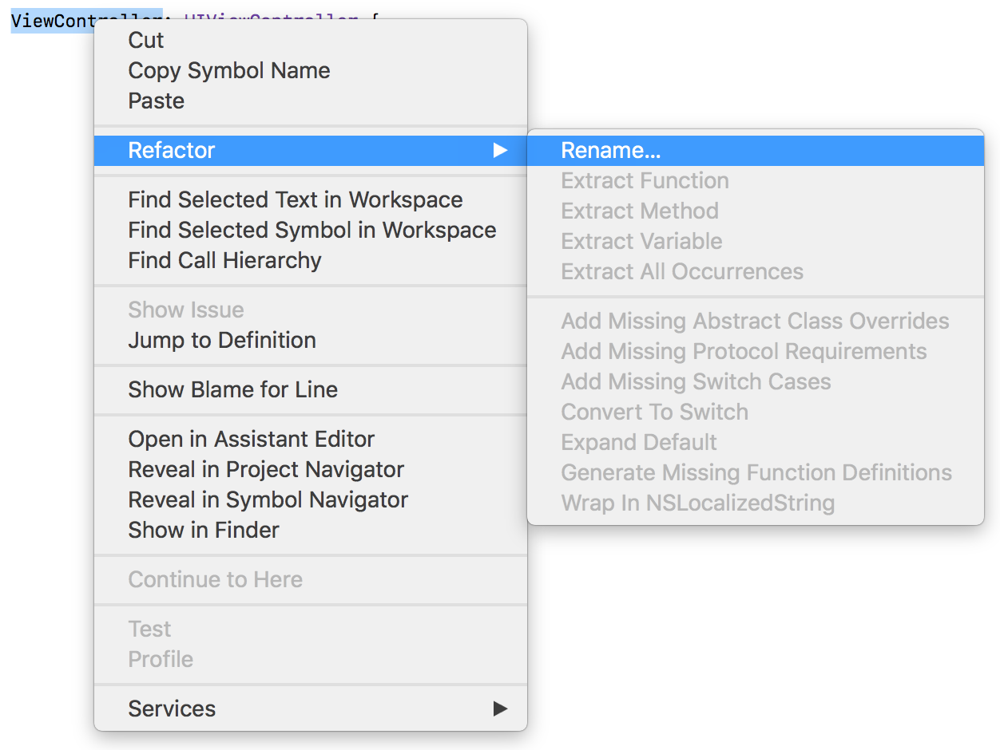

键入`QuestionViewController`作为新名称，然后按`Enter`进行更改。然后，在类`QuestionViewController`之前添加关键字`public`，如下所示：

在本书中，
- 您将使用public来表示应该对其他类型公开访问的类型、属性和方法；
- 使用private来表示应该只对类型本身可访问的内容；
- 使用internal来表示应该对子类或相关类型可访问但不打算用于一般用途的内容。这就是所谓的访问控制。


这是iOS开发中的“最佳实践”。如果您曾经将这些文件移动到一个单独的模块中，例如创建一个共享库或框架，那么如果遵循此最佳实践，您会发现做起来容易得多。
接下来，在文件层次结构中选择黄色的`RabbleWabble`组，并同时按`Command+Option+N`创建一个新组。
选择新组并按`Enter`键编辑其名称。输入`AppDelegate`，然后再次按`Enter`确认。
重复此过程为控制器、模型、资源和视图创建新组。
将`AppDelegate.swift`和`SceneDelegate.swift`移到`AppDelegate`组中，将`QuestionViewController.swift`移到`Controllers`中
`Assets.xcapets`和`Info.plist`进入`Resources`，并启动`screen.storyboard`和`Main.storyboard`进入视图。
最后，右键单击黄色的`RabbleWabble`组并选择`Sort by Name`（按名称排序）。

> “你对香肠好奇吗？这是iOS 13中引入的一个新类。它旨在允许一个应用程序的多个“场景”共存，甚至支持为您的应用程序同时运行多个窗口。这在大屏幕上尤其有用，比如iPad。
您不会在这个项目中使用`SceneDelegate`。如果您想了解更多信息，请查看我们的《快速入门教程》`(http://bit.ly/swiftuils by Tutorials)`一书

文件层次结构最终应该如下所示:
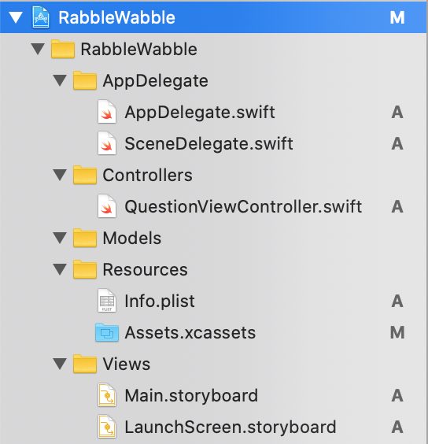

既然你移动了`Info.plist`，你需要告诉`Xcode`它的新位置在哪里。为此，请选择蓝色的`RabbleWabble`项目文件夹；选择`RabbleWabble`目标；选择`Build Settings`选项卡；在搜索框中输入`Info.plist`；双击`Packaging`部分下的`Info.plist`行；并将其文本替换为以下内容:
```
RabbleWabble/Resources/Info.plist
```

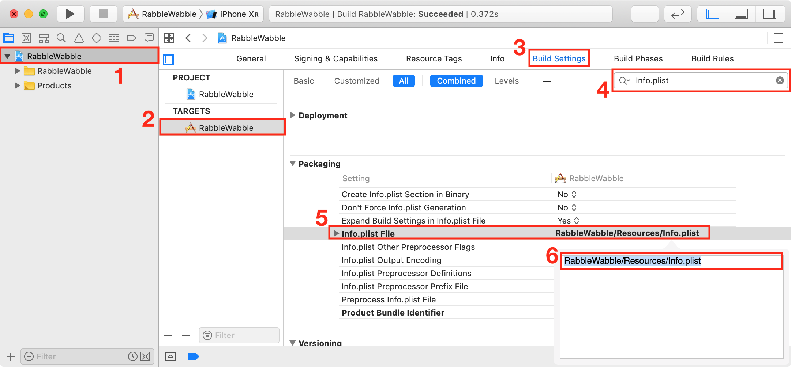

这是使用MVC模式的一个很好的开始！通过这样简单地对文件进行分组，您就可以告诉其他开发人员您的项目使用MVC。清晰度很好！

### 四: 创建models

接下来你将创建`Rabble Wabble`的模型。
首先，你需要创建一个问题模型。在文件层次结构中选择`Model`组，然后按`Command+N`创建新文件。从列表中选择`Swift File`并单击`Next`。将文件命名为`Question.swift`的全部内容替换为以下内容：

```
import Foundation

public struct Question {
    public let answer:String
    public let hint:String?
    public let prompt:String
}
```

您还需要另一个模型来充当一组问题的容器。
在模型组中创建另一个名为`QuestionGroup.swift`的文件，并将其全部内容替换为以下内容:

```
import Foundation

public struct QuestionGroup {
  public let questions: [Question]
  public let title: String
}
```

接下来，您需要添加问题组的数据。这可能相当于大量的重新输入，所以我提供了一个文件，您可以简单地拖放到项目中。

打开`Finder`并导航到为本章下载项目的位置。除了起始目录和最终目录，您将看到一个资源目录，其中包含`QuestionGroupData.swift`、`Assets.xcarets`和`LaunchScreen.storyboard`。
将`Finder`窗口放置在`Xcode`上方，然后将`QuestionGroupData.swift`拖放到Models组中，如下所示:

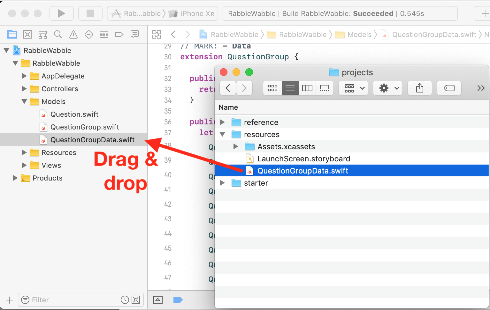

接下来，您需要添加问题组的数据。这可能相当于大量的重新输入，所以我提供了一个文件，您可以简单地拖放到项目中。

打开`Finder`并导航到为本章下载项目的位置。除了起始目录和最终目录，您将看到一个资源目录，其中包含`QuestionGroupData.swift`、`Assets.xcarets`和`LaunchScreen.storyboard`

将`Finder`窗口放置在`Xcode`上方，然后将`QuestionGroupData.swift`拖放到`Models`组中，如下所示:

接下来，在“视图”下选择应用程序中现有的`LaunchScreen.storyboard`，然后按`Delete`将其删除。再次，确保在提示时选择`Move to Trash`。然后，将新的`LaunchScreen.storyboard`从`Finder`拖放到应用程序的资源组中，在出现提示时检查复制项（如果需要）。
打开`QuestionGroupData.swift`，您将看到为基本短语、数字等定义了几个静态方法。这个数据集是日语的，但是如果您愿意的话，可以将它调整为其他语言。你很快就会用的！
打开`LaunchScreen.storyboard`，您将看到一个很好的布局，该布局将在应用程序启动时显示。

构建并运行以查看sweet应用程序图标和启动屏幕！

### 五：创建视图

现在需要设置MVC的“视图”部分。选择“视图”组，然后创建名为`QuestionView.swift`的新文件。
将其内容替换为以下内容:
```
import UIKit

public class QuestionView: UIView {
  @IBOutlet public var answerLabel: UILabel!
  @IBOutlet public var correctCountLabel: UILabel!
  @IBOutlet public var incorrectCountLabel: UILabel!
  @IBOutlet public var promptLabel: UILabel!
  @IBOutlet public var hintLabel: UILabel!
}
```

“接下来，打开`Main.storyboard`并滚动到现有场景。按住选项键并按对象库按钮以将其打开并防止其关闭。在搜索字段中输入`label`，然后将三个标签拖放到场景中而不重叠它们。

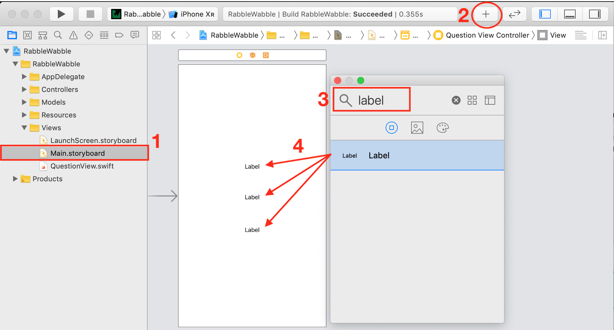

按交互窗口上的`红色X`，然后将其关闭。
双击最上面的标签并将其文本设置为提示。将中间标签的文本设置为提示，将底部标签的文本设置为应答。
选择提示标签，然后打开实用程序窗格并选择属性检查器选项卡。**将标签的字体设置为系统50.0，将其对齐方式设置为中心，将线条设置为0。**

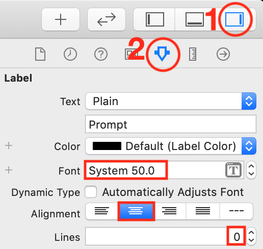

将提示标签的字体设置为`System 24.0`，对齐方式设置为`center`，行数设置为0。
将应答标签的字体设置为`System 48.0`，对齐方式设置为`center`，行数设置为0。

如果需要，请调整标签大小以防止剪切，并重新排列它们以保持相同的顺序而不重叠。
接下来，选择提示标签，选择“添加新约束”图标并执行以下操作：

- Set the top constraint to 60
- Set the leading constraint to 0
- Set the trailing constraint to 0
- Check constrain to margins
- Press Add 3 Constraints”
 
 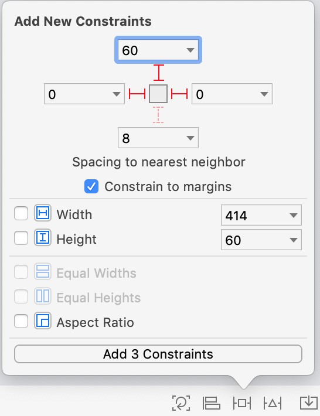

选择提示标签，选择添加新约束的图标并执行以下操作：

- Set the top constraint to 8
- Set the leading constraint to 0
- Set the trailing constraint to 0
- Check constrain to margins
- Press Add 3 Constraints

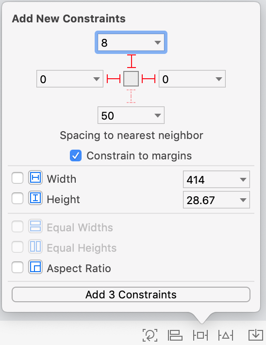


选择应答标签，选择添加新约束的图标，然后执行以下操作：
- Set the top constraint to 50.
- Set the leading constraint to 0.
- Set the trailing constraint to 0.
- Check constrain to margins.
- Press Add 3 Constraints.

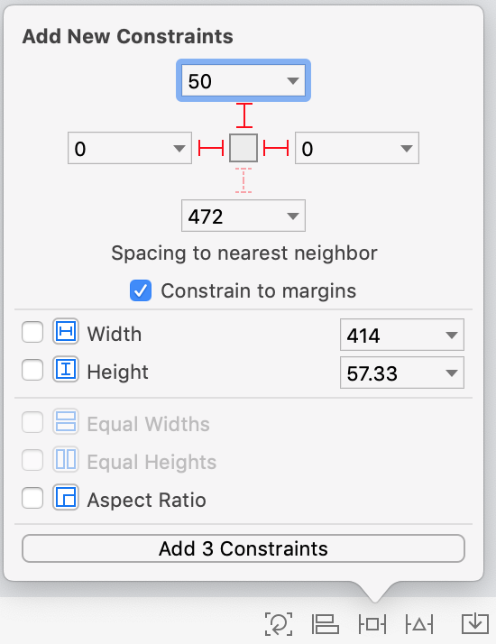


现在的场景应该是这样的:

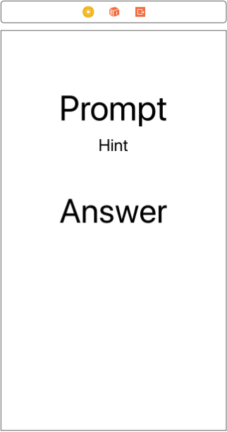

接下来，按对象库按钮，在搜索字段中输入`UIButton`并将新按钮拖到视图的左下角。
打开属性检查器，将按钮的图像设置为`ic_circle_x`，然后删除按钮的默认标题。

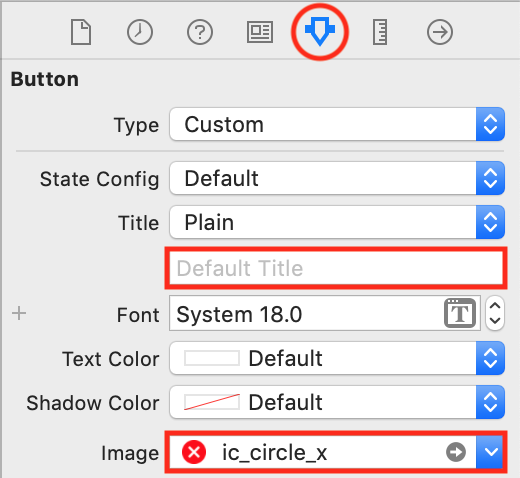

将另一个按钮拖到视图的右下角。删除按钮默认标题，并将其图像设置为`ic_circle_check`。
将新标签拖到场景上。将此项放在红色X按钮的正下方，并将其文本设置为0。打开属性检查器并设置颜色以匹配红色圆圈。将字体设置为`System 32.0`，并将对齐方式设置为`居中`。根据需要调整此标签的大小以防止剪切。

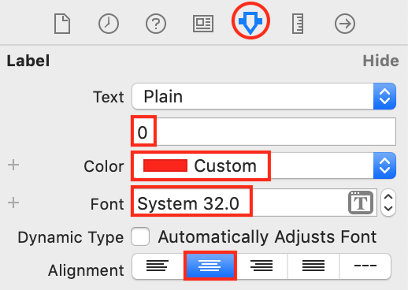


将另一个标签拖到场景中，将其放置在绿色复选按钮下方，并将其文本设置为0。打开属性检查器并设置颜色以匹配绿色圆圈。将字体设置为`System 32.0`，并将对齐方式设置为`居中`。根据需要调整此标签的大小以防止剪切。
接下来需要设置按钮和标签上的约束。
选择红色圆圈按钮，选择“添加新约束”图标并执行以下操作:
- Set the leading constraint to 32.
- Set the bottom constraint to 8.
- Check constrain to margins.
- Press Add 2 Constraints.

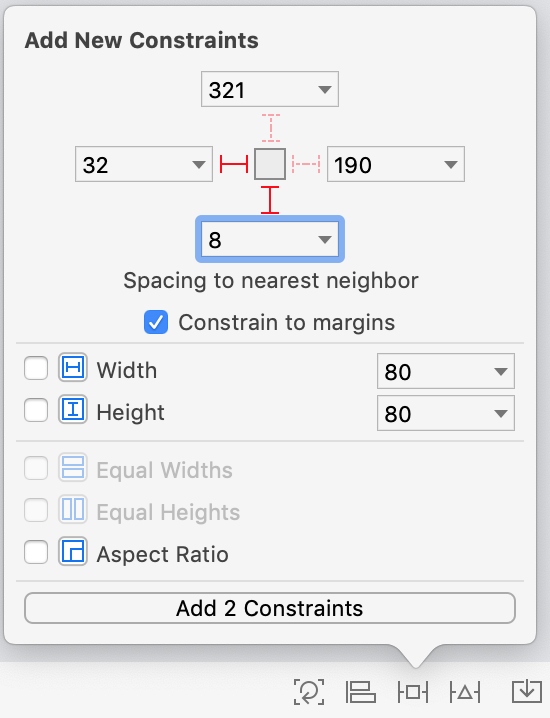

选择红色标签，选择“添加新约束”图标并执行以下操作：
- Set the bottom constraint to 24.
- Check constrain to margins.
- Press Add 1 Constraints.

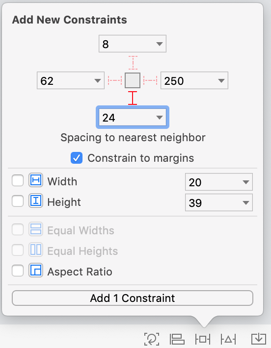


同时选择红色圆圈图像视图和红色标签，选择“对齐”图标并执行以下操作:

- Check the box for Horizontal Centers.
- Press Add 1 Constraint.

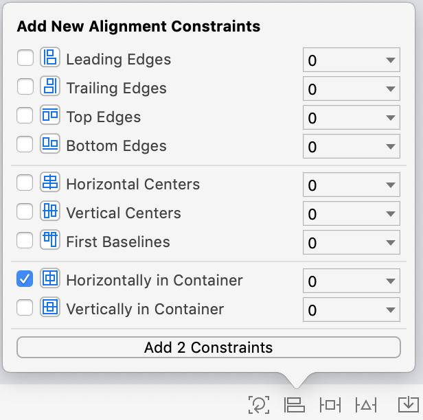
 
 选择绿色圆圈图像视图，选择“添加新约束”图标并执行以下操作：
 
 - Set the trailing constraint to 32.
 - Set the bottom constraint to 8.
 - Check constrain to margins.
 - Press Add 2 Constraints

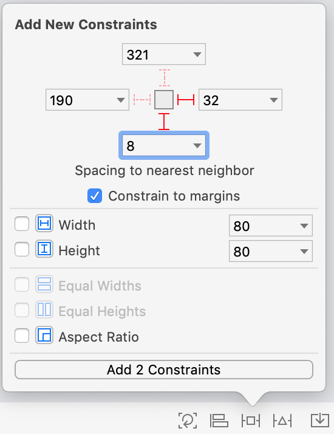

选择绿色标签，选择“添加新约束”图标，然后执行以下操作：

- Set the bottom constraint to 24.
- Check constrain to margins.
- Press Add 1 Constraints.


同时选择绿色圆圈图像视图和绿色标签，选择“对齐”图标并执行以下操作：

- Check the box for Horizontal Centers.
- Press Add 1 Constraint


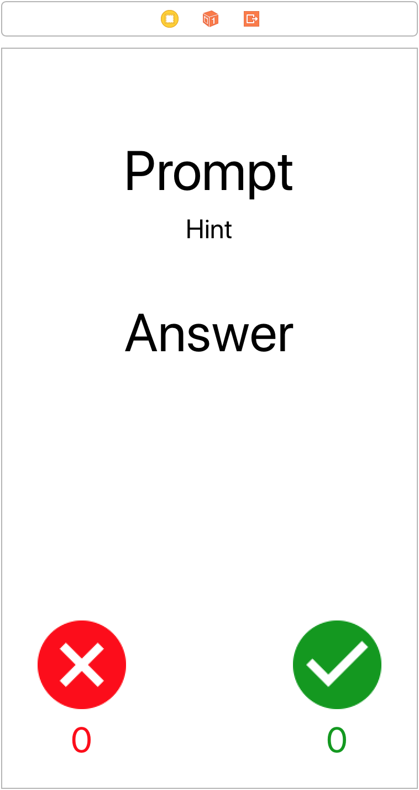

要完成`QuestionView`设置，需要在场景中设置视图的类并连接属性。

单击场景中的视图，注意不要选择任何子视图，然后打开标识检查器。将类设置为`QuestionView`

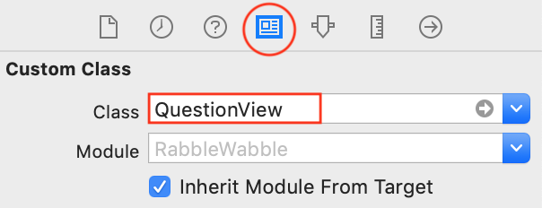

打开连接检查器并从每个出口拖动到相应的子视图，如图所示

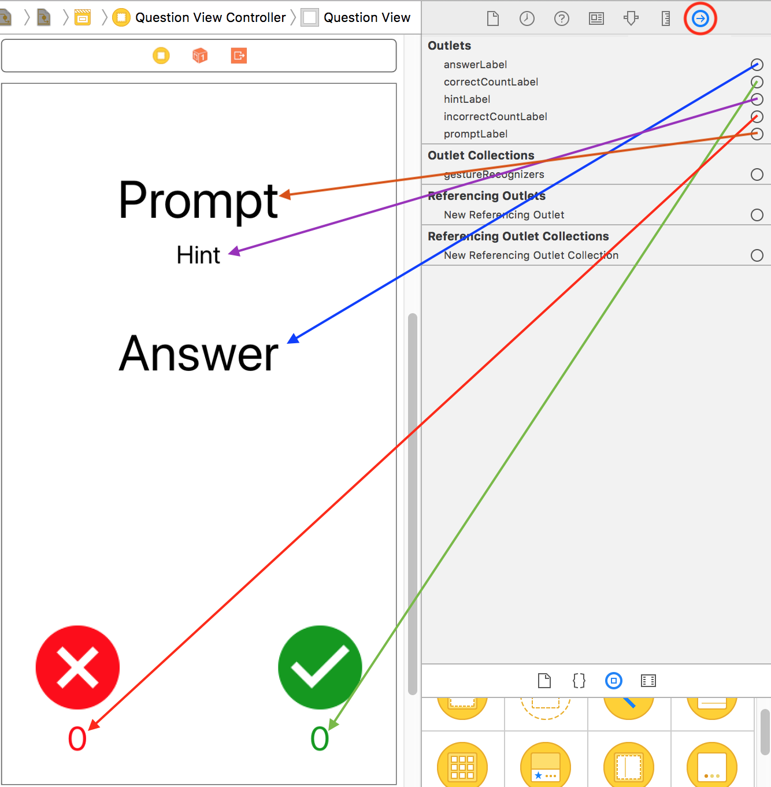

构建并运行并查看视图。令人惊叹的！

### 六：创建控制器

您终于可以创建MVC的“控制器”部分了。
打开`QuestionViewController.swift`并添加以下属性：

```
// MARK: - Instance Properties
public var questionGroup = QuestionGroup.basicPhrases()
public var questionIndex = 0

public var correctCount = 0
public var incorrectCount = 0

public var questionView: QuestionView! {
  guard isViewLoaded else { return nil }
  return (view as! QuestionView)
}
```

你现在把问题组硬编码成基本短语。在以后的章节中，您将展开应用程序，以便用户能够从列表中选择问题组。
问题索引是显示的当前问题的索引。您将在用户回答问题时增加这个值。
`correctCount`是正确响应的计数。用户通过按下绿色的检查按钮来指示正确的响应。

同样，`incorrect count`是不正确响应的计数，用户将通过按下红色的X按钮来指示。
`questionView`是计算属性。在这里，您选中`isViewLoaded`，这样就不会通过访问此属性而导致无意中加载视图。如果视图已加载，则强制将其强制转换为`QuestionView`。
接下来需要添加代码来实际显示问题。在刚添加的属性之后添加以下内容：

```
// MARK: - View Lifecycle
public override func viewDidLoad() {
  super.viewDidLoad()
  showQuestion()
}

private func showQuestion() {
  let question = questionGroup.questions[questionIndex]

  questionView.answerLabel.text = question.answer
  questionView.promptLabel.text = question.prompt
  questionView.hintLabel.text = question.hint

  questionView.answerLabel.isHidden = true
  questionView.hintLabel.isHidden = true
}
```

请注意这里您是如何在控制器中编写代码，以便基于模型中的数据来操作视图的。MVC FTW！
构建并运行以查看问题

现在，没有任何办法找到答案。你应该把它修好

在视图控制器的末尾添加以下代码：

```
// MARK: - Actions
@IBAction func toggleAnswerLabels(_ sender: Any) {
  questionView.answerLabel.isHidden =
    !questionView.answerLabel.isHidden
  questionView.hintLabel.isHidden =
    !questionView.hintLabel.isHidden
}
```

这将切换提示和答案标签是否隐藏。将“答案”和“提示”标签设置为隐藏在`showQuestion()`中，以便在每次显示新问题时重置状态。
这是一个视图通知其控制器已发生操作的示例。作为响应，控制器执行处理动作的代码。
您还需要将此操作连接到视图上。打开`Main.storyboard`并按对象库按钮。

在搜索字段中输入`tap`，然后将`tap`手势识别器拖放到视图中。
请确保将其拖到基础视图上，而不是其中一个标签或按钮！
控件从点击手势识别器对象拖动到场景上的问题视图控制器对象，然后选择`toggleAnswerLabels`

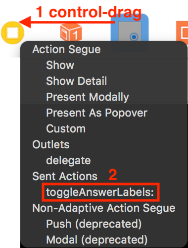

构建并运行，然后尝试点击视图以显示/隐藏答案和提示标签。

下一步，你需要处理的情况下，每当按钮被按下。
打开`QuestionViewController.swift`并在课程末尾添加以下内容：

```
// 1
@IBAction func handleCorrect(_ sender: Any) {
  correctCount += 1
  questionView.correctCountLabel.text = "\(correctCount)"
  showNextQuestion()
}

// 2
@IBAction func handleIncorrect(_ sender: Any) {
  incorrectCount += 1
  questionView.incorrectCountLabel.text = "\(incorrectCount)"
  showNextQuestion()
}

// 3
private func showNextQuestion() {
  questionIndex += 1
  guard questionIndex < questionGroup.questions.count else {
    // TODO: - Handle this...!
    return
  }
  showQuestion()
}
```

你又定义了三个动作。以下是每个人的做法：
- 每当用户按下绿色圆圈按钮以指示他们得到了正确的答案时，将调用`handleCorrect(:)`。在这里，增加`correctCount`并设置`correctCountLabel`文本。
- 每当用户按下红色圆圈按钮以指示他们得到的答案不正确时，将调用`handleIncorrect(:)`。在这里，增加`incorrectCount`并设置`incorrectCountLabel`文本。
- 调用`showNextQuestion()`以前进到下一个问题。你要注意的是，根据是否剩余，基于`questionIndex`是否小于`questionGroup.questions.count`，如果小于，则显示下一个问题。

“下一章你会处理没有问题的案子。
最后，需要将视图上的按钮连接到这些操作。打开`Main.storyboard`，选择红色圆圈按钮，然后控制拖到`QuestionViewController`对象上，然后选择`handleIncorrect:`。

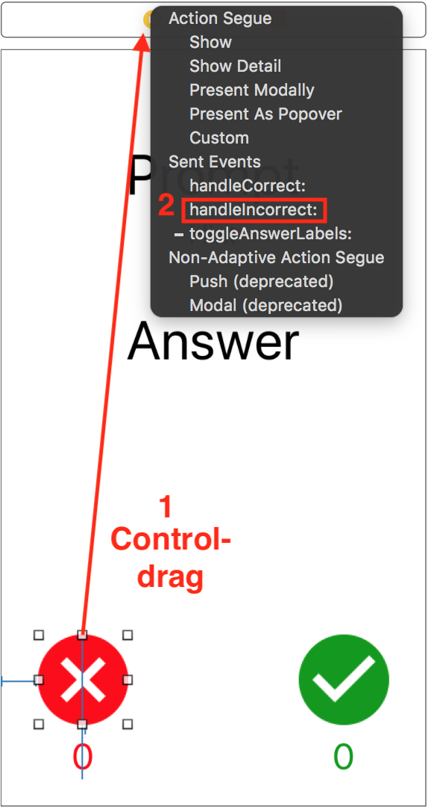

同样，选择绿色圆圈按钮，然后控制拖到`QuestionViewController`对象上并选择`handleCorrect:`。
这些视图再次通知控制器需要处理某些事情。建立并运行，然后尝试按每个按钮。

###  七 热点

在本章中，您学习了模型-视图-控制器（MVC）模式。以下是它的要点:
- MVC将对象分为三类：模型、视图和控制器。
- MVC促进了控制器之间模型和视图的重用。由于控制器逻辑通常非常具体，MVC通常不重用控制器。
- 控制器负责模型和视图之间的协调：它将模型值设置到视图上，并处理来自视图的`IBAction`调用。
- MVC是一个很好的起点，但它有局限性。并不是每个对象都能整齐地归入模型、视图或控制器的类别。您应该根据需要与MVC一起使用其他模式。

你已经有了一个很好的开始！但是，您仍然需要添加许多功能：让用户选择问题组，处理没有任何问题时发生的情况等等！
继续下一章，了解委托设计模式，并继续构建混乱的`Wabble`。
